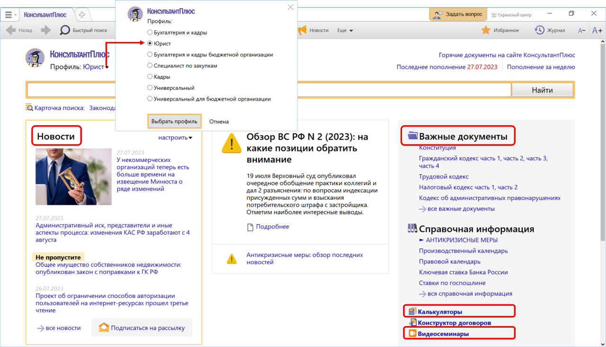
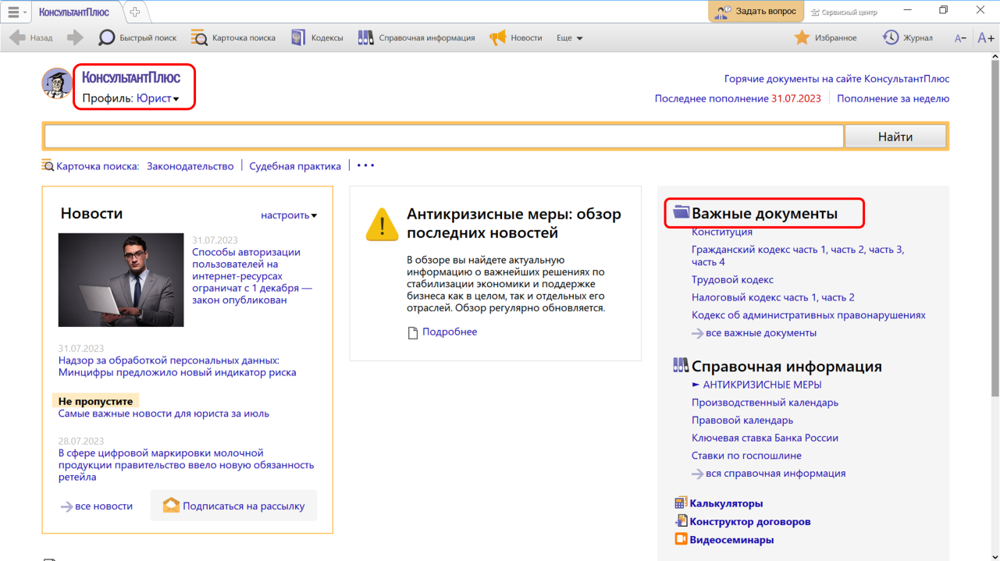
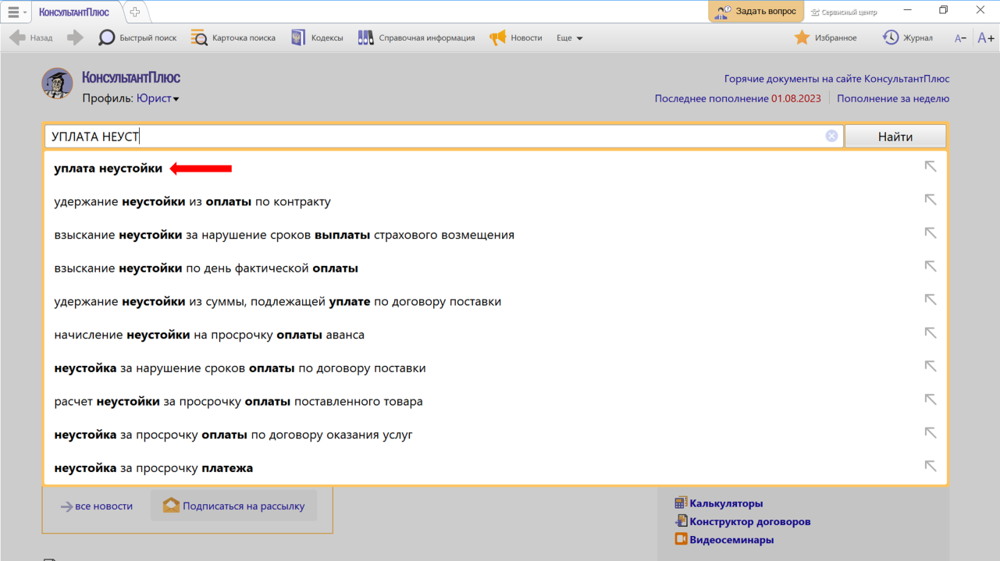
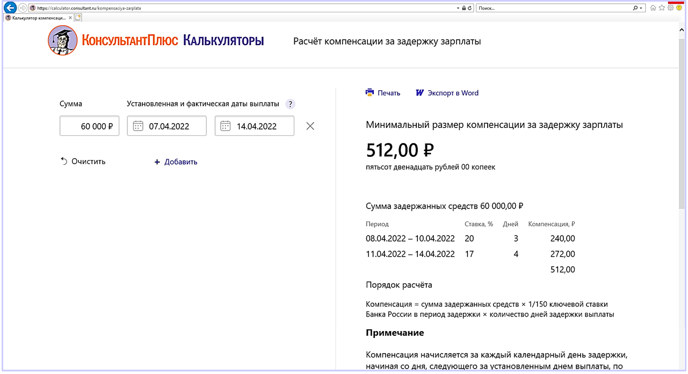
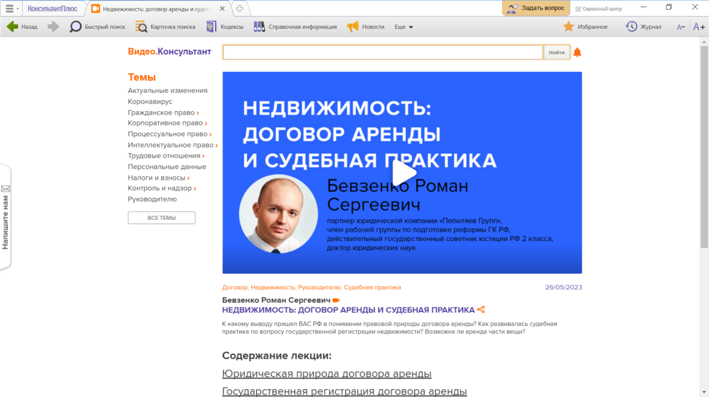

# Практическая работа с КонсультантПлюс №1

Чтобы юристу максимально быстро находить нужную информацию, систему КонсультантПлюс можно настроить под его профессиональные задачи. Для этого достаточно выбрать на стартовой странице профиль "Юрист".

## Примеры работы с системой

### Пример поиска документа в профиле "Юрист"

Выберем профиль "Юрист" и выясним, есть ли в окне "Важные документы", доступном по ссылке на стартовой странице, закон "О защите прав потребителей".

Решение:

1. На стартовой странице в списке профилей выберем "Юрист".
2. Перейдем по ссылке "Важные документы".
3. В открывшемся списке документов найдем нужный документ.

### Пример поиска информации в профиле "Юрист"

Требуется согласовать в договоре положение об уплате неустойки.

Решение:

1. Начнем вводить в строке Быстрого поиска: УПЛАТА НЕУСТОЙКИ.
2. При вводе запроса появились готовые подсказки. Выберем подходящий вариант.
3. Получим список, построенный с учетом потребностей юриста: нормативные акты по вопросу, судебная практика, фирменные материалы КонсультантПлюс.

### Пример работы с калькуляторами

С помощью калькулятора рассчитаем компенсацию за задержку заработной платы.

Решение:

1. Со стартовой страницы профиля «Юрист» перейдем по ссылке «Калькуляторы».
2. В открывшемся окне в разделе «Трудовые отношения» выберем «Калькулятор компенсации за задержку зарплаты»
3. Укажем сумму не выплаченной в срок работнику зарплаты (например, 60 000 руб.), дату, когда должны были выплатить зарплату и дату фактической выплаты (см. рис.). Минимальный размер компенсации за задержку зарплаты составит 512,00 руб.
4. При внесении данных можно посмотреть подсказки. Полученный результат можно распечатать или скопировать в Word.

### Пример поиска видеосеминара по теме

Найдем видеосеминар Бевзенко Р.С. «Недвижимость: договор аренды и судебная практика» и выясним, возможно ли аренда части вещи.

Решение:

1. Со стартовой страницы профиля «Юрист» перейдем по ссылке «Видеосеминары».
2. В окне с семинарами в поисковой строке зададим: БЕВЗЕНКО.
3. В перечне выберем семинар «Недвижимость: договор аренды и судебная практика» (см. рис.) и получим ответ на наш вопрос.

## Задания

### Задание №1

Выберите профиль «Юрист» и выясните, есть ли в окне «Важные документы», доступном по ссылке на стартовой странице, федеральный закон «О государственной регистрации юридических лиц и индивидуальных предпринимателей».

### Задание №2

Выберите профиль «Юрист» и укажите, есть ли непосредственно на стартовой странице в разделе «Справочная информация» ссылка на «Правовой календарь».

### Задание №3

Найдите видеосеминар Мулюна В.Н. «Что нужно знать о заключении договора». Укажите номер Постановления Пленума Верховного Суда РФ, на которое дана первая ссылка в видеосеминаре.

### Задание №4

Найдите видеосеминар Калятина В.О. «Лицензионный договор: существенные условия». Укажите количество пунктов оглавления лекции.
