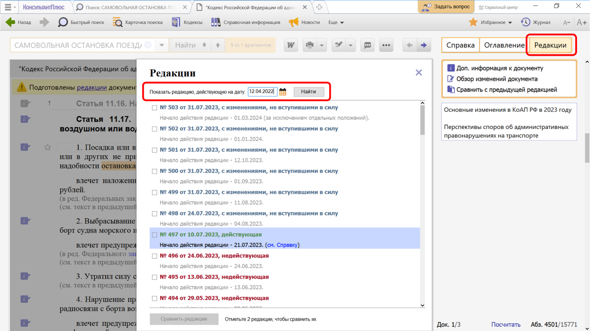
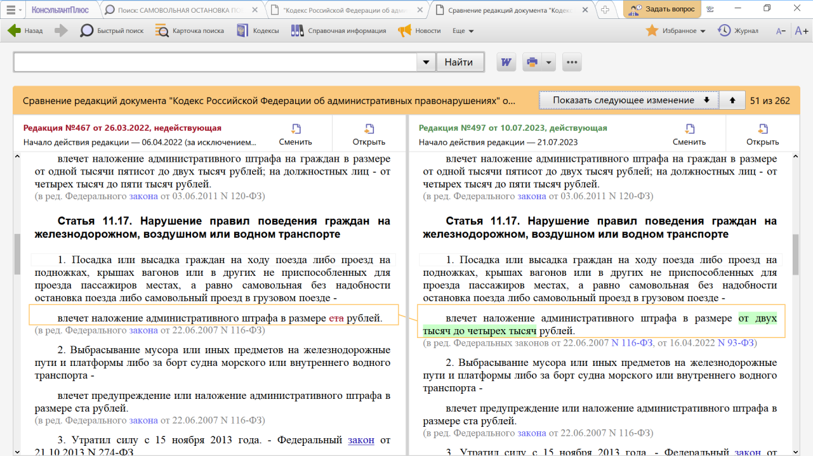
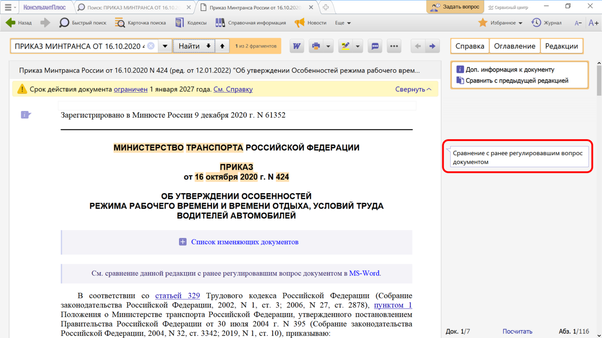
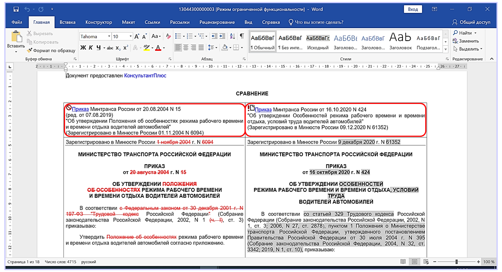

# Практическая работа с КонсультантПлюс №10
  
Довольно часто возникает потребность выяснить, как изменились правовые нормы, регулирующие наш вопрос. Для этого нужно обратиться к редакции документа, действовавшей на определенную дату, или воспользоваться возможностью «Сравнение с ранее действовавшим документом».

## Примеры работы с системой

### Пример работы с редакциями документа

12 апреля 2022 г. гражданин М. без необходимости, самовольно, сорвал стоп-кран в пассажирском поезде. Выясните размер штрафа, который мог быть наложен на гражданина М. за самовольную остановку поезда.

Решение:

1. В строке Быстрого поиска зададим: САМОВОЛЬНАЯ ОСТАНОВКА ПОЕЗДА и нажмем кнопку «Найти».
2. Перейдем в п. 1 ст. 11.17 КоАП РФ. В действующей редакции статьи указано, что в случае наложения штрафа при указанном нарушении его размер составляет от 2000 до 4000 руб. Однако в данной ситуации следует применить редакцию статьи, действовавшую на момент совершения правонарушения.
3. Чтобы найти редакцию статьи, актуальную на 12 апреля 2022 г., нажмем кнопку «Редакции» на правой панели, в строке поиска редакций зададим: 12.04.2022 и нажмем кнопку «Найти» (см. рис.).

4. Мы попадем в недействующую в настоящее время редакцию КоАП РФ. Чтобы увидеть, произошли ли в данной статье какие-либо изменения, воспользуемся ссылкой на правой панели «Сравнить с действующей редакцией». В результате тексты обеих редакций (именно ст. 11.17) откроются в одном окне, причем все изменения будут выделены цветом, что очень удобно для сравнения (см. рис.). Мы видим, что на день совершения правонарушения размер штрафа составлял 100 руб.

### Пример сравнения действующего и отмененного документов

Приказ Минтранса России от 20.08.2004 N 15 «Об утверждении Положения об особенностях режима рабочего времени и времени отдыха водителей автомобилей» утратил силу 01.01.2021. С этой даты вступил в силу новый документ – Приказ Минтранса России от 16.10.2020 N 424 «Об утверждении Особенностей режима рабочего времени и времени отдыха, условий труда водителей автомобилей». Сравните эти документы и выясните, какие между ними различия.

Решение:

1. В строке Быстрого поиска зададим: ПРИКАЗ МИНТРАНСА ОТ 16.10.2020 N424 и нажмем кнопку «Найти».
2. Откроем текст приказа. Чтобы посмотреть сравнение, перейдем по ссылке под заголовком документа. Можно сравнить документы, используя примечание на правой панели (см. рис.). В документе, утратившем силу, аналогичное примечание будет размещено на правой панели.

3. Сравнение документов откроется в виде таблицы в Word (см. рис.). Мы сразу видим все различия между ранее действовавшим документом и новым: что было удалено, что добавлено.

## Задания

### Задание №1

25 апреля 2021 года гражданин К, двигаясь на своем автомобиле, совершил выезд на железнодорожный переезд при закрывающемся шлагбауме и был оштрафован на 5 тыс. руб. Выясните, правомерен ли размер штрафа.

### Задание №2

Гражданка И, работница ООО "Рассвет", в соответствии со ст. 185.1 ТК РФ, была освобождена от работы на один день (7 августа 2020 года) для прохождения диспансеризации. Может ли работодатель потребовать предоставить медсправку, подтверждающую прохождение диспансеризации, если да, то в каком случае?

### Задание №3

Выясните размер штрафа, который может быть назначен за публичное распространение с помощью сети Интернет заведомо ложных сведений о деятельности СССР в годы Второй мировой войны, если оно было совершено 15 апреля 2021 года.

### Задание №4

Укажите минимальный срок лишения свободы, к которому мог бы быть приговорен гражданин В за участие в преступном сообществе, если приговор был вынесен 11.04.2019.

### Задание №5

Уточните, в каких документах должны быть проставлены отметки о составлении акта, согласно правилам перевозок грузов автомобильным транспортом, если акт был составлен 28.12.2020.
