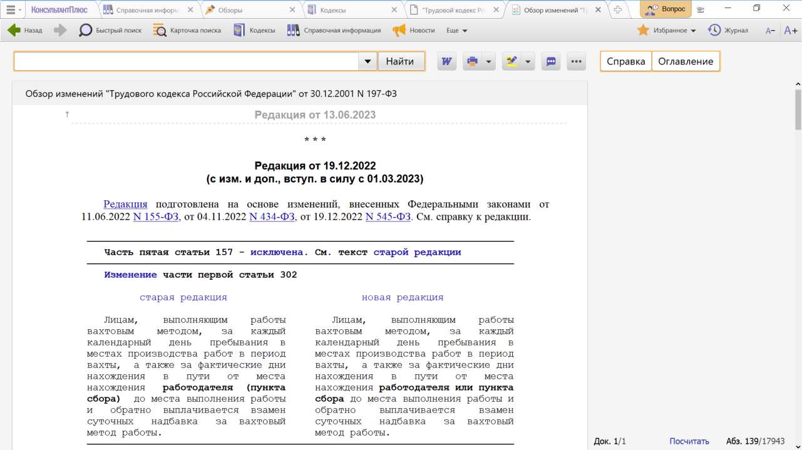

# Практическая работа с КонсультантПлюс №11
  
В системе КонсультантПлюс представлены обзоры изменений в законодательстве в целом и обзоры изменений, произошедших в конкретных документах. Они помогут всегда быть в курсе последних изменений в законодательстве.

## Примеры работы с системой

### Пример поиска обзора изменений в законодательстве

Найдем обзоры изменений в законодательстве в сфере гражданского права за последние четыре недели.

Решение:

1. Откроем окно «Обзоры» с помощью кнопки «Обзоры» панели инструментов.
2. В разделе «Новости. Мониторинг документов» откроем рубрику «Новое в законодательстве» (см. рис.).
3. В полученном списке выберем обзор изменений за последние 12 недель и перейдем в его текст.
4. Воспользуемся поиском по Оглавлению и найдем рубрику «Гражданское право» за нужные недели.
К свежим новостям, которые добавляются в режиме реального времени, можно перейти из специализированной онлайн-ленты на стартовой странице.

### Пример поиска аналитических обзоров

Найдем аналитические обзоры по вопросам трудовых споров.

Решение:

1. Откроем окно «Обзоры» с помощью кнопки на панели инструментов.
Если кнопка «Обзоры» не видна на панели инструментов, нажмем кнопку «Еще» и выберем опцию «Обзоры».
2. В разделе «Аналитические обзоры правовой информации» выберем рубрику «Актуальные темы» (см. рис.). Появится список обзоров.
3. В строке поиска по списку зададим: ТРУДОВЫЕ СПОРЫЗАКЛЮЧЕНИЕ ТРУДОВОГО ДОГОВОРА и нажмем кнопку «Найти».
Получен список нужных нам обзоров.

### Пример обзора изменений в документе

Найдем обзор последних изменений Трудового кодекса РФ.

Решение:

1. Откроем Трудовой кодекс РФ.
2. Находясь в тексте закона, перейдем по ссылке "Обзор изменений документа" на правой панели.
3. Обзор представлен в виде таблицы с фрагментами документа, в которые внесены изменения: в левом столбце – текст в старой редакции, в правом столбце – в новой редакции. Все изменения выделены жирным шрифтом (см. рис.). Если в документ вводится статья или пункт целиком, то дается ссылка на этот пункт в тексте самого документа.

### Пример постановки документа на контроль 

Поставим на контроль ст. 65 Трудового кодекса РФ.

Решение:

1. В строке Быстрого поиска зададим: СТ 65 ТК РФ.
2. Перейдем в текст ст. 65 Трудового кодекса РФ.
3. Нажмем кнопку «Избранное» панели инструментов, выберем «Добавить в Избранное», в появившемся окне перейдем на вкладку «Документы на контроле» и нажмем кнопку «Добавить».
4. В появившемся окне (см. рис.) выберем «Только фрагмент» и нажмем кнопку «Добавить». Ст. 65 Трудового кодекса РФ будет поставлена на контроль и одновременно документ будет размещен во вкладке «Документы на контроле» окна «Избранное».

## Задания

### Задание №1

Найдите обзор изменений Семейного кодекса РФ. Укажите номера статей, в которые были внесены изменения в последней редакции кодекса.

### Задание №2

Поставьте на контроль Гражданский кодекс РФ.

### Задание №3

Перейдите в текст главы 2 закона "О защите прав потребителей" и поставьте ее на контроль. Укажите, какие варианты отслеживания будут предложены системой.

### Задание №4

Найдите обзор "Новое в российском законодательстве" за последние 12 недель". Выясните, содержится ли в нем информация о проектах федеральных законов.

### Задание №5

Выясните, какие важнейшие для юриста изменения произошли в законодательстве за прошлую неделю, и укажите их количество.
