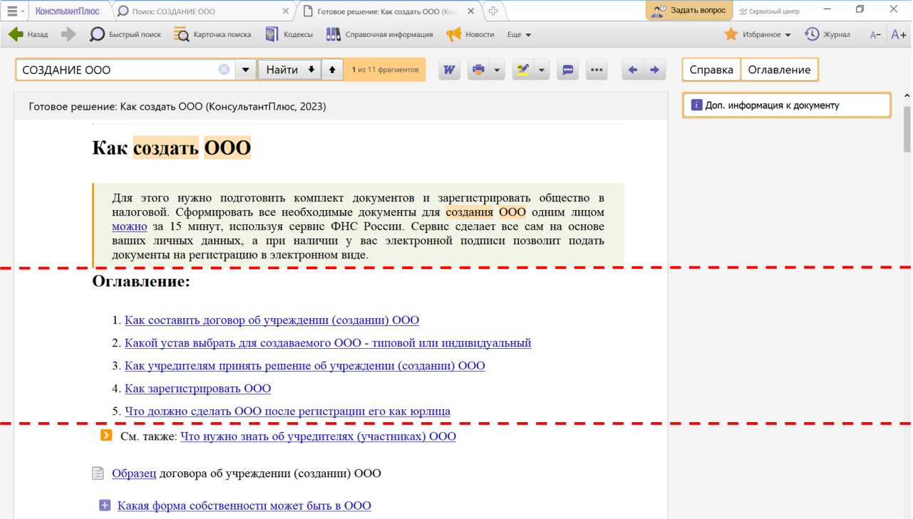
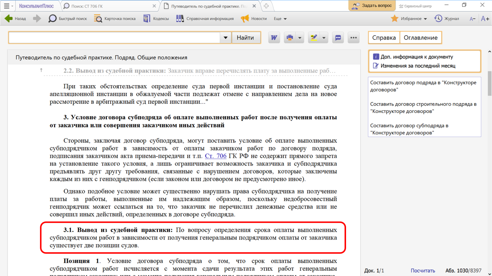
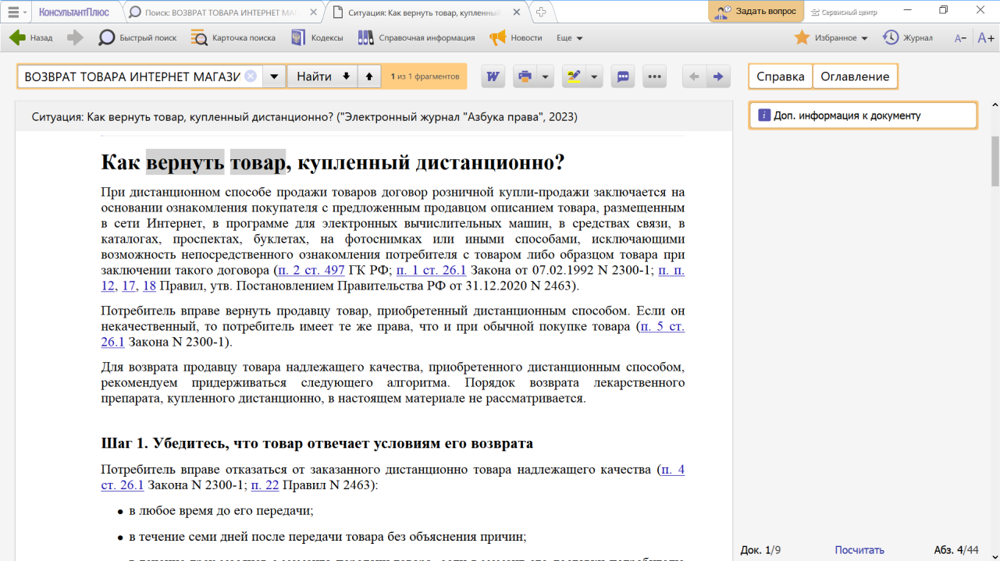

# Практическая работа с КонсультантПлюс №12
  
Особый интерес для юристов представляют фирменные материалы КонсультантПлюс. Они подскажут, как действовать в конкретной ситуации, содержат примеры и ссылки на нужные документы.

## Примеры работы с системой

### Пример поиска ответа с помощью Готовых решений

Выясним, как создать ООО.

Решение:

1. В строке Быстрого поиска зададим: СОЗДАНИЕ ООО.
2. Откроем Готовое решение «Как создать ООО (КонсультантПлюс)» (см. рис.).
3. В начале материала кратко изложено самое главное. Есть интерактивное оглавление, с помощью которого можно быстро перейти к конкретному вопросу (например, как учредителям принять решение об учреждении общества). Дан подробный ответ со ссылками на законодательство и дополнительную информацию, разъясняется, как составить договор о создании ООО, как учредителям принять решение об учреждении общества, как зарегистрировать его. Даны ссылки на образцы документов, подготавливаемых в процессе создания ООО.
4. По ссылкам можно ознакомиться дополнительно со смежными вопросами. Например, что нужно знать об учредителях (участниках) ООО.

### Пример поиска ответа с помощью Путеводителей КонсультантПлюс

Генеральный подрядчик предлагает фирме-субподрядчику заключить договор с условием, по которому расчеты между ними будут произведены только после поступления денежных средств от заказчика. Выясним, соответствует ли такое условие договора положениям ст. 706 ГК РФ

Решение:

1. В строке Быстрого поиска зададим: СТ 706 ГК и нажмем кнопку «Найти».
2. Перейдем к ст. 706 ГК РФ «Генеральный подрядчик и субподрядчик». Мы видим, что статья напрямую не регулирует наш вопрос.
3. После заголовка статьи представлен перечень проблем, связанных с ее применением. Этот список позволяет перейти к изучению соответствующей судебной практики в «Путеводителе по судебной практике (ГК РФ)». Выберем вопрос «Условие договора субподряда об оплате выполненных работ после получения оплаты от заказчика или совершения заказчиком иных действий».
4. По ссылке перейдем в п. 3 «Путеводителя по судебной практике. Подряд. Общие положения».
5. После формулировки проблемы размещен комментарий специалистов, раскрывающий причины возникновения проблемы, с анализом норм законодательства и с соответствующими ссылками. Сделан вывод из судебной практики 3.1, в котором указано, что наш вопрос представлен двумя позициями судов (см. рис.).
Каждая позиция подтверждена выдержками из судебных решений, в полные тексты которых можно перейти по ссылкам. Анализируя позиции, следует учесть, что по первой позиции есть акты Верховного Суда Российской Федерации, в том числе «Обзор судебной практики Верховного Суда Российской Федерации».

### Пример поиска ответа с помощью Азбуки права

Купив джинсы в интернет-магазине, вы решили их вернуть. Выясним, в течение какого срока это можно сделать.

Решение:

1. В строке Быстрого поиска зададим: ВОЗВРАТ ТОВАРА ИНТЕРНЕТ МАГАЗИН и нажмем кнопку «Найти».
2. Откроем материал в начале списка: «Ситуация: Как вернуть товар, купленный дистанционно?» из электронного журнала «Азбука права» (см. рис.).
3. В материале дан подробный ответ со ссылками на законодательство и дополнительную информацию.

## Задания

### Задание №1

Выясните, какие последствия влечет просрочка исполнения обязательства. Воспользуйтесь готовым решением. Укажите, может ли кредитор приостановить исполнение своего обязательства, если должник допустил просрочку.

### Задание №2

Уточните, можно ли, согласно ст. 54 ГК РФ, использовать слово "русский" в фирменном наименовании юрлица без специального разрешения?

### Задание №3

Выясните, что нужно учитывать, чтобы отличить мнимую сделку от притворной, согласно ст. 170 ГК РФ. Найдите ответ в «Готовом решении».

### Задание №4

Выясните, может ли заказчик не оплачивать работы по договору подряда, если он признан недействительным, но работы представляют для него потребительскую ценность.

### Задание №5

Работник Н. был уволен в связи с истечением срока трудового договора в период его временной нетрудоспособности. Является ли увольнение в такой ситуации правомерным?

### Задание №6

Выясните, в каком количестве можно ввезти товары из-за границы физическому лицу для личного пользования.

### Задание №7

Вы с друзьями собирались на выходные в Санкт-Петербург. Но по семейным обстоятельствам поездку пришлось отложить. Выясните, какую часть от стоимости билета вы можете получить при условии, что вернули неиспользованный билет за 5 часов до отправления поезда.
