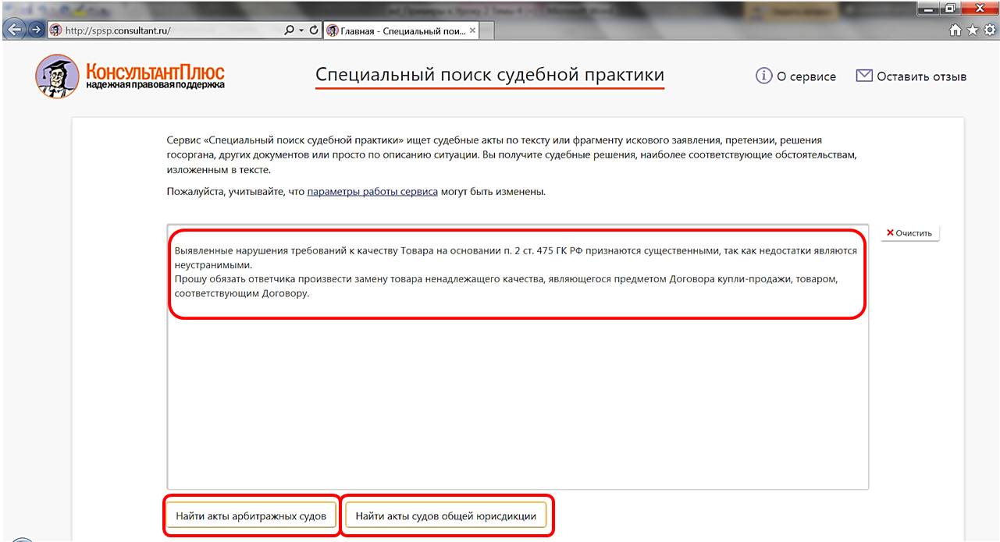

# Практическая работа с КонсультантПлюс №13
  
В системе КонсультантПлюс для работы доступно более 250 млн материалов судебной практики, которые размещаются в разделе «Судебная практика» и в онлайн-архивах. Это решения судов всех инстанций всех судов РФ.

## Примеры работы с системой

### Пример поиска ответа с помощью важнейшей практики по статье

Изучим судебную практику по вопросу одностороннего отказа от исполнения договора возмездного оказания услуг, чтобы оценить риски.

Решение:

1. В строке Быстрого поиска укажем ОДНОСТОРОННИЙ ОТКАЗ ОТ ДОГОВОРА ОКАЗАНИЯ УСЛУГ.
2. Откроем ст. 782 ГК РФ «Односторонний отказ от исполнения договора возмездного оказания услуг».
3. На правой панели перейдем к важнейшей практике по ст. 782 ГК РФ. В документе (см. рис.) приведены основные решения высших судов по теме, проанализированы распространенные судебные споры. Представлена неоднозначная судебная практика, что позволит пользователям оценить риски в подобных ситуациях.

### Пример поиска ответа с помощью правовых позиций высших судов

Выясним, может ли в соответствии со ст. 218 ГК РФ снятие автомобиля с регистрационного учета свидетельствовать о прекращении права собственности на него.

Решение:

1. В строке Быстрого поиска зададим: СТ 218 ГК.
2. Перейдем к ст. 218 ГК РФ. Видим, что статья не дает прямого ответа на наш вопрос.
3. Чтобы найти позицию высших судов по нашему вопросу, перейдем по ссылке «Позиции высших судов по ст. 218 ГК РФ», которая размещается под заголовком статьи.
4. Откроется «Перечень позиций высших судов к ст. 218 ГК РФ». В поисковой строке зададим: АВТОМОБИЛЬ и нажмем кнопку «Найти».
5. В результате будет найден п. 3.2.1 (см. рис.), в котором рассмотрена наша ситуация: «Снятие автомобиля с регистрационного учета не свидетельствует о прекращении (переходе) права собственности на него (позиция ВС РФ)».
6. Перейдем в документ, в котором представлены краткое описание позиции суда по нашему вопросу, список применимых правовых норм и суть позиции. По ссылкам можно перейти в тексты судебных актов и изучить их (см. рис.).

### Пример поиска похожих судебных решений

Найдем и изучим судебную практику по вопросу о возможности признать недвижимостью строение, у которого нет фундамента и прочной связи с грунтом.

Решение:

1. В строке Быстрого поиска (вкладка «Судебная практика») зададим: НЕТ ФУНДАМЕНТА и нажмем кнопку «Найти».
2. Выберем Определение Верховного Суда РФ от 15.06.2021 N 301-ЭС21-9200 по делу N А38-6638/2019 и перейдем в него. Из документа следует, что Верховный Суд отказал в передаче дела в Судебную коллегию по экономическим спорам Верховного Суда РФ, так как суды, руководствуясь ст. ст. 130, 131 ГК РФ, пунктом 52 постановления Пленумов ВС РФ и ВАС РФ от 29.04.2010 N 10/22 «О некоторых вопросах, возникающих в судебной практике при разрешении споров, связанных с защитой права собственности и других вещных прав», установив, что у павильона отсутствует заглубленный фундамент, конструкция торгового павильона не рассчитана на длительный срок эксплуатации, пришли к выводу об отсутствии у него признаков недвижимости, удовлетворив заявленный по делу иск.
3. Найдем похожие судебные решения. Ссылка «Похожие судебные акты» размещена под реквизитами постановления и на правой панели (см. рис.). Система автоматически подберет похожие решения арбитражных судов всех округов. Похожие решения соответствуют юридическим и фактическим обстоятельствам исходного дела.

### Пример поиска ответа с помощью онлайн-сервиса «Специальный поиск судебной практики»

Найдем практику арбитражных судов по фрагменту искового заявления о поставке некачественного товара: «Выявленные нарушения требований к качеству Товара на основании п. 2 ст. 475 ГК РФ признаются существенными, так как недостатки являются неустранимыми. Прошу обязать ответчика произвести замену товара ненадлежащего качества, являющегося предметом Договора купли-продажи, товаром, соответствующим Договору».

Решение:

1. Со стартовой страницы перейдем по ссылке «Специальный поиск судебной практики».
2. Скопируем в поисковое окно фрагмент искового заявления и найдем акты арбитражных судов с помощью соответствующей кнопки (см. рис.).

### Пример получения подборки судебных решений (карточка поиска раздела «Судебная практика»)

Найдем судебную практику по искам арендаторов об устранении препятствий в пользовании арендованным имуществом, по которым было принято решение об отказе в удовлетворении исковых требований.

Решение:

1. Откроем карточку поиска раздела «Судебная практика».
2. В поле «Категория спора» выберем: АРЕНДА ИЛИ СУБАРЕНДА ЗДАНИЙ И СООРУЖЕНИЙ (В Т.Ч. ПОМЕЩЕНИЙ).
3. В поле «Требования» выберем требование арендатора: ОБ УСТРАНЕНИИ ПРЕПЯТСТВИЙ В ПОЛЬЗОВАНИИ ИМУЩЕСТВОМ.
4. Нажмем кнопку «Показать список документов». В результате получен список решений, максимально соответствующих указанному требованию (см. рис.). В информационном комплексе «Арбитражные суды округов» можно выбрать информационный банк интересного нам округа и изучить решения судов по вопросу.

## Задания

### Задание №1

В соответствии с договором купли-продажи продавец обязался поставить ООО «Полюс» определенную продукцию, однако своих обязательств не выполнил. Впоследствии ООО «Полюс» (кредитор) уступило право на возмещение причиненных ему убытков другому юридическому лицу. Правомерно ли это в соответствии со ст.15 ГК РФ?

### Задание №2

У компании существует задолженность перед кредитором, который имеет встречное обязательство по уплате неустойки. Выясните, можно ли прекратить эти обязательства зачетом в соответствии со ст. 410 ГК РФ.

### Задание №3

Уточните, правомерно ли увольнение по ст. 81 ТК РФ, если работник был задержан в состоянии опьянения на контрольно-пропускном пункте организации-работодателя?

### Задание №4

Выясните, какие позиции судов существуют по вопросу квалификации договора на ремонт транспортного средства.

### Задание №5

Найдите судебную практику по искам арендодателя о взыскании задолженности по арендным платежам. Укажите, какие поля Карточки поиска были использованы при поиске.

### Задание №6

С целью изучения судебной практики по вопросу взыскания неустойки в пользу поставщика по договору поставки между коммерческими организациями найдите постановления Арбитражного суда Московского округа, принятые в 1 полугодии 2022 г. и касающиеся данного вопроса. Укажите количество найденных документов.
