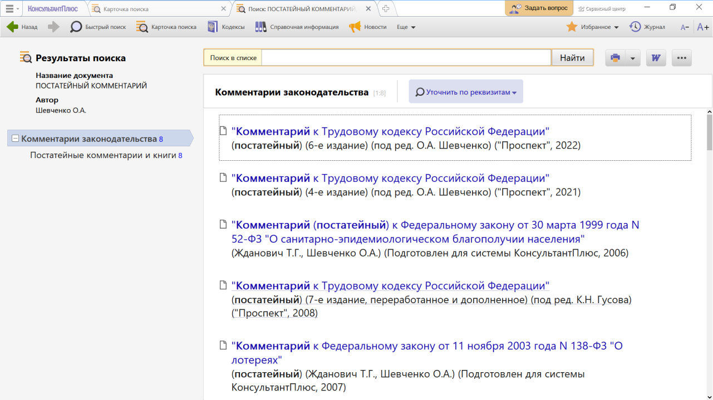
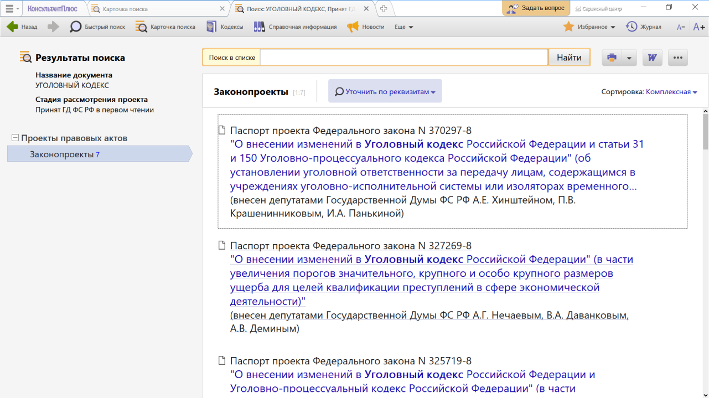
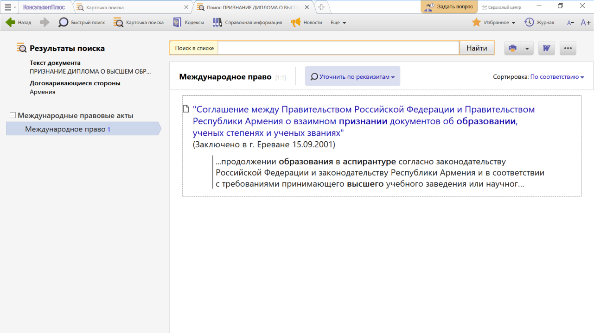
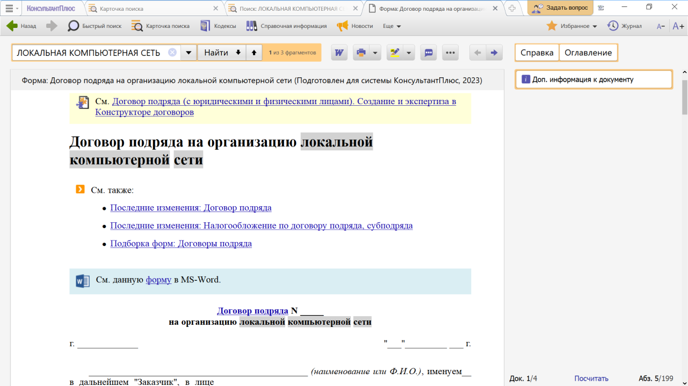

# Практическая работа с КонсультантПлюс №14
  
Помимо федерального и регионального законодательства, судебной практики система КонсультантПлюс содержит другую важную для юристов информацию: комментарии к нормативным документам, законопроекты, документы международного права и пр. Такие документы собраны в различных разделах системы КонсультантПлюс.

Все разделы подробно описаны в системе помощи пользователю, вызвать которую можно клавишей F1.

## Примеры работы с системой

### Пример поиска постатейного комментария к кодексу в разделе «Комментарии законодательства»

Найдем постатейный комментарий к Трудовому кодексу Российской Федерации под редакцией О.А. Шевченко, изданный в 2022 году.

Решение:

1. Откроем Карточку поиска раздела «Комментарии законодательства».
2. В поле «Автор» зададим: ШЕВЧЕНКО О.А.
3. В поле «Название документа» зададим: ПОСТАТЕЙНЫЙ КОММЕНТАРИЙ
4. Построим список документов (см. рис.). Будет найден документ «Комментарий к Трудовому кодексу Российской Федерации» (постатейный), под ред. О.А. Шевченко: Проспект 2022.

### Пример поиска законопроектов в разделе «Проекты правовых актов»

Найдем все законопроекты, вносящие изменения в Уголовный кодекс РФ, принятые Государственной Думой ФС РФ в первом чтении.

Решение:

1. Войдем в Карточку поиска раздела «Проекты правовых актов».
2. В поле «Название документа» введем: УГОЛОВНЫЙ КОДЕКС.
3. В поле «Стадия рассмотрения проекта» выберем: ПРИНЯТ ГД ФС РФ В ПЕРВОМ ЧТЕНИИ.
4. Построим список документов с помощью кнопки «Показать список документов» (см. рис.).

5. Получим список паспортов законопроектов, в которых содержатся редакции данных законопроектов в различных чтениях, а также сопроводительные материалы к законопроектам.

### Пример поиска документов в разделе «Международные правовые акты»

После окончания Белгородского государственного университета У. хочет поступить в аспирантуру Ереванского государственного университета. Выясним, имеется ли соглашение между Россией и Арменией о взаимном признании дипломов о высшем образовании и какие права на продолжение образования в Армении предоставляются обладателям российского диплома специалиста.

Решение:

1. Войдем в Карточку поиска раздела «Международные правовые акты».
2. В поле «Договаривающиеся стороны» зададим: АРМЕНИЯ.
3. В поле «Текст документа» зададим: ПРИЗНАНИЕ ДИПЛОМА О ВЫСШЕМ ОБРАЗОВАНИИ АСПИРАНТУРА.
4. Нажмем кнопку «Показать список документов».
5. Откроем «Соглашение между Правительством Российской Федерации и Правительством Республики Армения о взаимном признании документов об образовании, ученых степенях и ученых званиях» (см. рис.). В ст. 7 содержится информация по нашему вопросу.
6. Перейдем в Справку к документу. В ней указано, что соглашение вступило в силу с 09.01.2002.

### Пример поиска документов в разделе «Формы документов»

Найдем форму договора на выполнение работ по созданию локальной компьютерной сети в рабочем помещении. Сохраним ее в Word.

Решение:

1. Откроем Карточку поиска раздела «Формы документов».
2. В поле «Текст документа» введем: ЛОКАЛЬНАЯ КОМПЬЮТЕРНАЯ СЕТЬ.
3. В поле «Вид документа» укажем: ДОГОВОР (ФОРМА).
4. Нажмем кнопку «Показать список документов».
5. Откроем форму «Договор подряда на организацию локальной компьютерной сети (Подготовлен для системы КонсультантПлюс)».
6. Скопируем договор в Word, щелкнув по ссылке «См. данную форму в MS-Word» (см. рис.). Текст будет экспортирован в документ Word.
7. Вернемся в текст договора в системе КонсультантПлюс. Обратим внимание, что в п. 2.1.6 содержится ссылка на акт выполненных работ, который является приложением к данному договору. Он также содержится в информационном банке «Деловые бумаги» в виде отдельного документа.
8. Используя значок «i» на правой панели (см. рис.) можно получить полный список приложений к договору, не просматривая весь текст.

## Задания

### Задание №1

Найдите книгу Рачкова И.В. о Всемирной торговой организации и укажите фамилии рецензентов.

### Задание №2

Найдите учебное пособие о коммерческих корпорациях как субъектах корпоративных правоотношений, изданное в 2020 г. Укажите количество страниц.

### Задание №3

Найдите статью «Особенности правового режима видеоигр», опубликованную в одном из номеров журнала «Предпринимательское
право» за 2022 г. Укажите, в каком номере журнала опубликована статья.

### Задание №4

Найдите ст. 105 УК РФ и разъясняющие материалы к данной статье. Статьи из журнала «Российский судья» сохраните в папку с
названием «105 УК», созданную в системе КонсультантПлюс. Сохраните данную папку в файл и укажите расширение полученного
файла.

### Задание №5

Найдите конвенцию Совета Европы о борьбе с фальсификацией медицинской продукции и сходными преступлениями, угрожающими
здоровью населения (Заключена в г. Москве 28.10.2011). Выясните, какие страны ратифицировали ее в 2016 г.

### Задание №6

Найдите «Женевскую конвенцию о защите гражданского населения во время войны». Укажите, когда конвенция вступила в силу для СССР. Сохраните в Word таблицу подписаний, ратификаций и оговорок по данной конвенции.

### Задание №7

Уточните, в какой срок должно быть рассмотрено заявление гражданина Беларуси о выдаче вида на жительство в Российской
Федерации, в соответствии с "Соглашением между Российской Федерацией и Республикой Беларусь об обеспечении равных прав
граждан Российской Федерации и Республики Беларусь на свободу передвижения, выбор места пребывания и жительства на
территориях государств-участников Союзного государства" (Заключено в г. Санкт-Петербурге 24.01.2006).

### Задание №8

Найдите чистый бланк заявления физлица о государственной регистрации в качестве индивидуального предпринимателя. Откройте его в формате PDF для заполнения. Укажите официальный номер формы.

### Задание №9

Найдите образец заполнения договора об учреждении (создании) ООО. Укажите фамилии граждан, заключивших данный договор.

### Задание №10

Найдите форму договора оказания услуг по размещению рекламы в Интернете. Укажите, какой тип файла у документа, открывающегося по ссылке «См. данную форму в MS Word».
