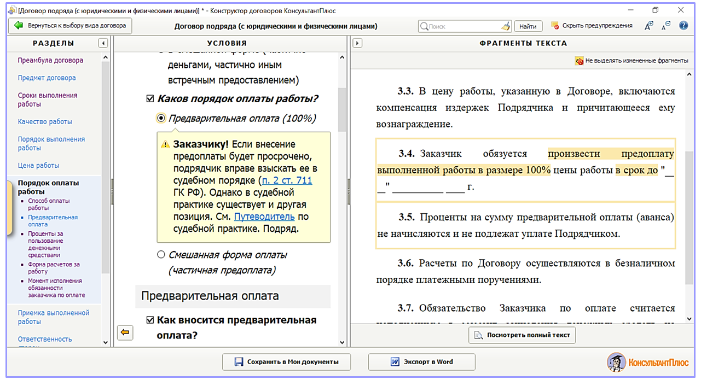
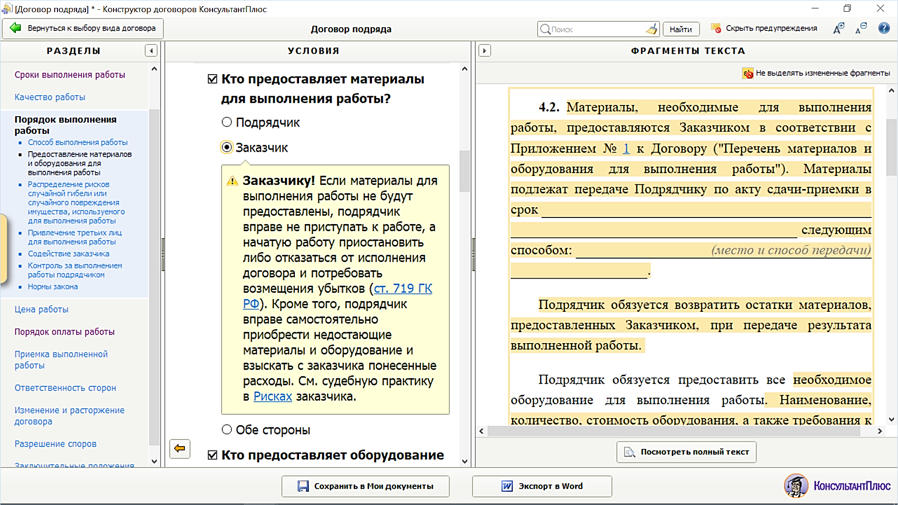

# Практическая работа с КонсультантПлюс №15
  
Конструктор договоров.

## Примеры работы с системой

### Пример создания проекта договора

Составим и экспортируем в Word договор подряда со следующими условиями:
— начало работы — с момента внесения заказчиком аванса;
— размер предоплаты — 100%.

Решение:

1. Перейдем к «Конструктору договоров» по ссылке на стартовой странице (при наличии доступа в интернет).
2. Выберем договор подряда (с юридическими и физическими лицами). В правой части окна появится информация о данном виде договора: его суть, существенные условия договора, отличие от других договоров.
3. Нажмем кнопку «Создать договор». Откроется окно создания договора. Оно разделено на три части:
   - левая часть — выбор раздела создаваемого договора. Это, по сути, его оглавление;
   - средняя часть — вопросы об условиях договора и варианты ответов для выбранного раздела;
   - правая часть — демонстрируется фрагмент текста создаваемого раздела, который изменяется в зависимости от выбранных условий (см. рис.).
4. Выберем раздел «Сроки выполнения работы». Найдем вопрос «Как определяется начальный срок выполнения работы?» и выберем в нем ответ «Указанием на событие». Появится список событий, где выберем вариант «уплата заказчиком аванса».
5. Установим условие о 100-процентной предоплате. Выберем раздел «Порядок оплаты работы» и найдем вопрос «Каков порядок оплаты работы?». В нем есть только 2 варианта: «Предварительная оплата (100%)» и «Смешанная форма оплаты (частичная предоплата)». Отсутствует вариант ответа «Оплата после выполнения работы» в связи с тем, что ранее выбрано условие об исчислении срока с момента внесения заказчиком аванса, т.е. предполагается наличие аванса. Выберем вариант «Предварительная оплата (100%)» (см. рис.). Появится предупреждение о рисках для заказчика при выборе данного варианта. Кроме того, мы увидим новую группу условий, касающихся выбранного нами варианта оплаты.
6. В области «Фрагменты текста договора» появится выбранное условие (п. 3.4). Изменения выделены. После того как условия договора выбраны, нажмем кнопку «Посмотреть полный текст». Откроется составленный нами проект договора подряда. Его можно сохранить в папке «Мои договоры» или сохранить в Word.
7. Сохраним текст договора в Word. Нажмем кнопку «Экспорт в Word» (см. рис.). При этом можно выбрать варианты «с предупреждениями» или без них. Предупреждения могут быть необходимы для дальнейшей работы с договором.

### Пример экспертизы договора

Проанализируем образец договора подряда, скопированный с одного из интернет-сайтов. В частности, обратим внимание, что договором предусмотрена обязанность заказчика предоставить подрядчику материалы.

Решение:

1. Перейдем к «Конструктору договоров» по ссылке на стартовой странице (при наличии доступа в интернет). В рубрикаторе выберем договор подряда (с юридическими и физическими лицами).
2. Нажмем кнопку «Создать договор». Будем последовательно указывать в «Конструкторе договоров» те условия, которые зафиксированы в анализируемом образце (т.е. с помощью «Конструктора договоров» составляем договор, аналогичный образцу).
3. Укажем в договоре, что материалы для работы должен предоставить заказчик. Найдем раздел «Порядок выполнения работы» и выберем группу условий «Предоставление материалов и оборудования для выполнения работы». В средней части появляются вопросы для выбранного нами раздела. Найдем вопрос «Кто предоставляет материалы для выполнения работы?», выберем ответ «Заказчик». Появится предупреждение о последствиях неисполнения данной обязанности (см. рис.). Ознакомимся с судебной практикой по вопросу, перейдя по ссылке «См. судебную практику в Рисках заказчика».

## Задания

### Задание №1

Составьте проект договора подряда, включающий следующее условие: подписывают договор представители сторон, действующие на основании простой письменной доверенности. Какие статьи Гражданского кодекса РФ указаны в примечании о рисках к выбранному условию?

### Задание №2

Компания-подрядчик прислала на согласование вариант договора подряда, в котором в п. 3.2 указано, что цена работы является приблизительной. Какие риски возникают у заказчика в связи с этим пунктом договора?

### Задание №3

Вы устраиваетесь на работу. В трудовом договоре, который предлагает подписать работодатель, указан ненормированный рабочий день. В каких случаях это правомерно? Какие последствия возникнут у сторон, если ненормированный рабочий день установлен необоснованно?

### Задание №4

При приеме на работу нового сотрудника работодатель составляет договор и хочет указать в нем, что работник принимается по совместительству. Выясните, есть ли какие-либо ограничения.
