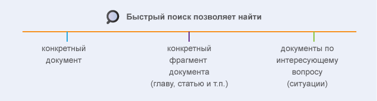
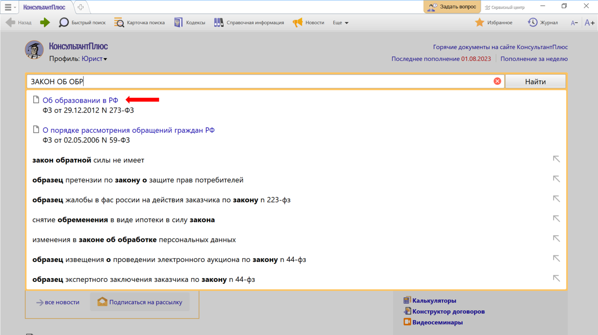
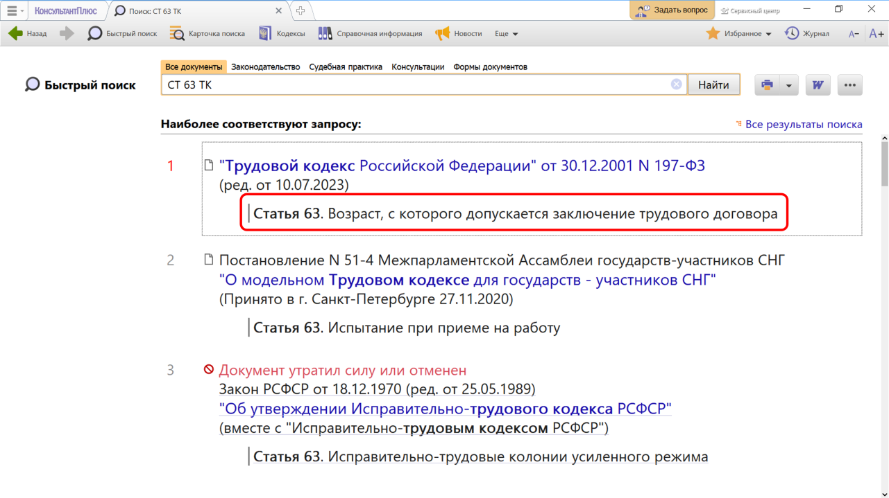
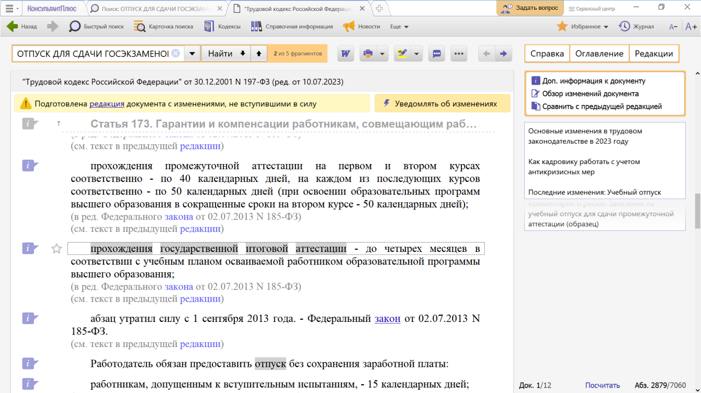

# Практическая работа с КонсультантПлюс №2

Наиболее простой способ поиска документов в системе — Быстрый поиск.

Свойство Быстрого поиска:

- запрос вводится привычным языком
- можно использовать профессиональную лексику и привычные сокращения («больничный» вместо «лист нетрудоспособности»)
- можно использовать реквизиты документа или номер статьи
- подсказки, которые появляются во время ввода запроса, содержат наиболее популярные запросы. По ним можно уточнить поиск
- найденные документы представлены единым списком (нормативные документы, судебные решения, комментарии и т.п.), разбиваются по страницам (по 10 документов на каждой странице) и отсортированы по важности в соответствии с выбранным профилем
- в найденных документах под заголовком указывается точный фрагмент, куда попадает пользователь при входе в документ
- можно ограничить область поиска с помощью вкладок окна Быстрого поиска «Законодательство», «Судебная практика», «Консультации», «Формы документов»

## Примеры работы с системой

### Пример поиска конкретного документа

Найдем Федеральный закон «Об образовании в Российской Федерации».

Решение:

1. В Быстром поиске начнем набирать: ЗАКОН ОБ ОБРАЗОВАНИИ.
Появится список подсказок
2. Перейдем по подсказке в закон.

### Пример поиска фрагмента документа

Найдем ст. 63 Трудового кодекса РФ «Возраст, с которого допускается заключение трудового договора».

Решение:

1. Зададим в Быстром поиске: СТ 63 ТК и нажмем кнопку «Найти».
Документы появляются сразу, до построения всего списка.
2. Из списка перейдем по ссылке в нужную статью кодекса. Документ сразу откроется на ст. 63.

### Пример поиска документов по интересующему вопросу

Выясним, какова продолжительность отпуска для сдачи госэкзаменов работникам-студентам, обучающимся по заочной форме обучения.

Решение:

1. В Быстром поиске зададим: ОТПУСК ДЛЯ СДАЧИ ГОСЭКЗАМЕНОВ и нажмем кнопку «Найти».
2. В начале списка Трудовой кодекс РФ. Откроем его.
3. ТК РФ откроется на ст. 173, в которой указано, что продолжительность отпуска для прохождения государственной итоговой аттестации ‒ до четырех месяцев в соответствии с учебным планом осваиваемой работником образовательной программы высшего образования.

## Задания

### Задание №1

Найдите Федеральный конституционный закон «О Правительстве
Российской Федерации». Укажите дату одобрения данного закона
Государственной Думой РФ.

### Задание №2

Найдите ст. 12.18. «Непредоставление преимущества в движении
пешеходам или иным участникам дорожного движения» Кодекса РФ
об административных правонарушениях. Укажите максимальный
размер штрафа за данное правонарушение.

### Задание №3

Найдите ст. 42 «Содержание брачного договора» Семейного
кодекса РФ. Укажите, сколько пунктов в данной статье.

### Задание №4

Во время авиаперелета был утерян багаж гражданки К. Выясните,
имеет ли она право потребовать компенсацию за утрату багажа. Если
да, то в каком размере.

### Задание №5

Гражданин Антонов хочет заключить брак с гражданкой Ивановой-
Штраус и объединить с ней фамилии, чтобы и у нее, и у него была
общая тройная фамилия. Выясните, возможно ли это.

### Задание №6

Н. купил в магазине книгу и дома обнаружил, что одна из страниц в
ней оказалась непропечатанной. Укажите, в течение какого периода
можно предъявить претензии продавцу, если на товар не установлен
гарантийный срок.
