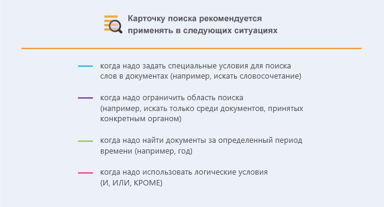
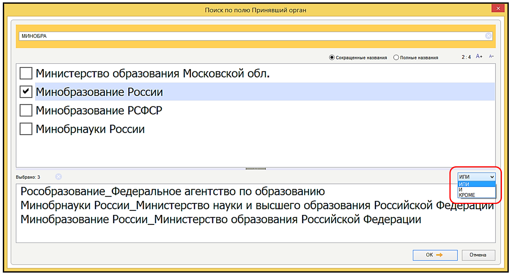
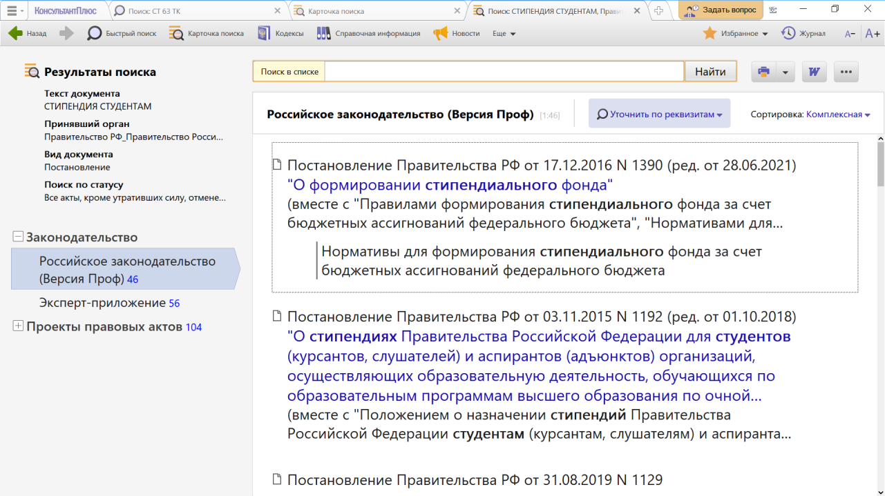
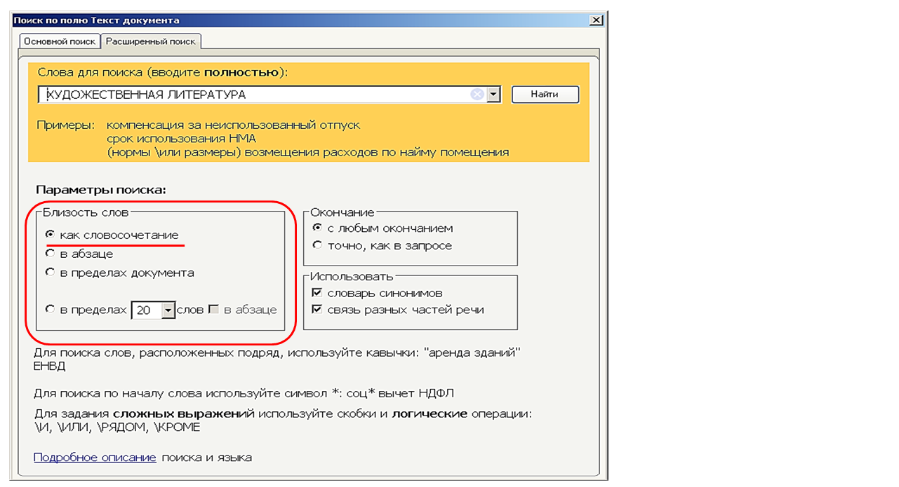

# Практическая работа с КонсультантПлюс №3

Карточка поиска позволяет искать документы по известным реквизитам (номер, вид, принявший орган, дата принятия). С помощью Карточки поиска можно найти конкретный документ или составить подборку документов по теме.

Основные преимущества Карточки поиска:

- может искать по всем документам системы и по ее отдельным разделам
- карточки поиска разных разделов могут содержать уникальные поля
- можно указать конкретную дату принятия документа или диапазон дат (месяц, год, последние три года и т.д.)
- в поиске по тексту и названию можно задавать сложные выражения с использованием логических условий (и, или, кроме), указывать близость слов, использовать словарь сокращений
- результат поиска представлен в виде дерева-списка: слева – перечень разделов и информационных банков, справа – список документов выбранного информационного банка
- можно искать в своих папках документов
- есть кнопка «История и сохраненные запросы» для быстрого перехода в Историю запросов (журнал)
  
## Примеры работы с системой

### Пример поиска конкретного документа

Найдем документ с разъяснением по вопросу получения образовательного кредита с государственной поддержкой. При этом мы точно не знаем, кем принят этот документ: то ли Минобразованием РФ, то ли Рособразованием, то ли Минобрнауки РФ.

Решение:

1. Откроем Карточку поиска (область поиска «Законодательство» установлена по умолчанию).
2. В поле «Принявший орган» выберем значения МИНОБРНАУКИ РОССИИ, РОСОБРАЗОВАНИЕ, МИНОБРАЗОВАНИЕ РОССИИ (см. рис.).
3. Соединим их логическим условием ИЛИ (см. рис.).
4. В поле «Текст документа» введем: ПОЛУЧЕНИЕ ОБРАЗОВАТЕЛЬНОГО КРЕДИТА С ГОСПОДДЕРЖКОЙ.
5. Нажмем кнопку «Показать список документов».
6. Будет найдено Письмо Минобрнауки России от 17.02.2021 N МН-18/226-АО «Об информировании обучающихся о существующей возможности получения образовательного кредита с государственной поддержкой», в котором даны разъяснения по нашему вопросу.

### Пример создания подборки документов по теме

Найдем действующие постановления Правительства РФ, касающиеся стипендий студентам.

Решение:

1. Заполним Карточку поиска:

- в поле «Вид документов» зададим: ПОСТАНОВЛЕНИЕ
- в поле «Принявший орган» зададим: ПРАВИТЕЛЬСТВО РФ
- в поле «Текст документа» введем: СТИПЕНДИЯ СТУДЕНТАМ
- в поле «Поиск по статусу» выберем: ВСЕ АКТЫ, КРОМЕ УТРАТИВШИХ СИЛУ, ОТМЕНЕННЫХ И НЕ ВСТУПИВШИХ В СИЛУ
2. Нажмем кнопку «Показать список документов». В результате будут найдены документы, которые соответствуют всем условиям (см. рис.).

### Пример создания подборки документов по теме

Найдем все документы, изданные Правительством РФ, в которых есть словосочетание «художественная литература».

Решение:

1. Заполним Карточку поиска:

- в поле «Текст документа» выберем вкладку «Расширенный поиск» и введем: ХУДОЖЕСТВЕННАЯ ЛИТЕРАТУРА. Отметим параметры поиска: близость слов как словосочетание (см. рис.)
- в поле «Принявший орган» выберем значение ПРАВИТЕЛЬСТВО РФ

2. Нажмем кнопку «Показать список документов». В результате будут найдены документы, которые соответствуют всем условиям.

## Задания

### Задание №1

Найдите документ, принятый в IV квартале 2020 г., регулирующий вопросы целевого обучения по программам высшего образования и, в частности, устанавливающий типовую форму договора. Укажите номер данного документа.

### Задание №2

Найдите постановление Правительства РФ, изданное в 2021 г., которым утверждаются правила предоставления субсидий на выплату стипендий для талантливых молодых авторов литературных, музыкальных и художественных произведений. Укажите дату начала действия документа.

### Задание №3

Найдите указы Президента Российской Федерации, изданные с начала 2021 г., в названии которых упоминается гражданство. Укажите количество найденных документов из информационного банка «Правовые акты РФ».

### Задание №4

Найдите статьи, опубликованные с начала 2021 г., в которых упоминаются понятия «кража» или «грабеж». Укажите количество найденных документов из информационного Банка «Юридическая пресса». Также укажите поля Карточки поиска, которые были использованы при поиске.

### Задание №5

Найдите документы, изданные за последние два года, в которых говорится о Всероссийском физкультурно-спортивном комплексе «Готов к труду и обороне» (ГТО). В полученном списке найдите документ, содержащий нормативы испытаний ГТО. Укажите количество подтягиваний на перекладине на золотой знак для юношей возрастной группы от 18 до 19 лет.

### Задание №6

Найдите приказы Генпрокуратуры России, в которых содержатся инструкции. Укажите количество найденных документов.
