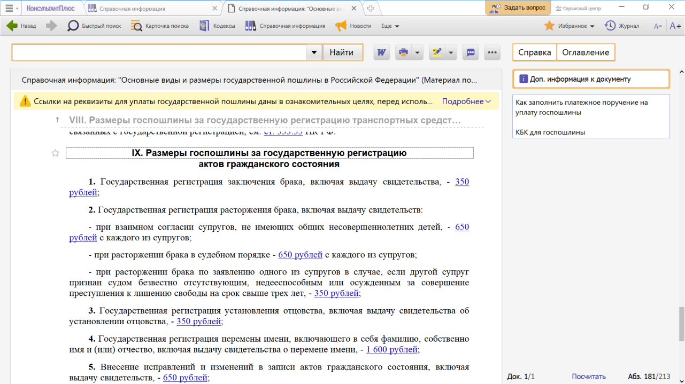
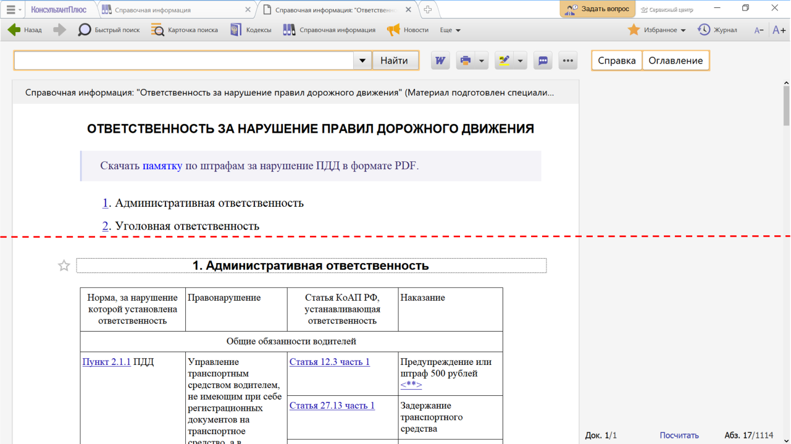

# Практическая работа с КонсультантПлюс №4

Самый простой способ найти справочные материалы (курсы валют, правовой календарь, адресно-реквизитную информацию, порядок вступления в силу различных нормативных актов и т.д.) – перейти по ссылке со стартовой страницы системы в окно «Справочная информация».

Перейти в Справочную информацию можно также через панель инструментов.
  
## Примеры работы с системой

### Пример поиска информации справочного характера

Нужно определить размер госпошлины за государственную регистрацию заключения брака.

Решение:

1. На стартовой странице в разделе «Справочная информация» по ссылке «Государственная пошлина» перейдем в документ «Основные виды и размеры (ставки) государственной пошлины в Российской Федерации».
2. Откроем оглавление документа и найдем нужный пункт - IX. Размеры госпошлины за государственную регистрацию актов гражданского состояния.
3. Перейдем в текст документа и найдем нужную информацию.

### Пример поиска информации справочного характера

Выясним, какая ответственность предусмотрена за нарушение правил дорожного движения.

Решение:

1. Откроем окно «Справочная информация» с помощью кнопки панели инструментов.
2. Найдем рубрику «Справочная юридическая информация» и перейдем по ссылке «Ответственность за нарушение правил дорожного движения» в соответствующий документ.
3. Информация собрана из разных нормативных актов, хорошо структурирована и представлена в виде таблицы (см. рис.). По ссылке под названием документа можно скачать памятку по штрафам за нарушение ПДД в формате PDF.

## Задания

### Задание №1

Укажите действующую на данный момент величину прожиточного минимума для трудоспособного населения г. Москвы.

### Задание №2

Определите актуальный на 1 сентября 2023 г. размер ключевой ставки, установленной Банком России.

### Задание №3

Выясните, какие праздничные дни, установленные на федеральном уровне, есть в декабре. Укажите номер указа Президента, которым был утвержден День юриста.

### Задание №4

Найдите размеры госпошлины за регистрацию физического лица в качестве индивидуального предпринимателя. Опишите пошагово порядок решения.

### Задание №5

Выясните, каковы условия и порядок вступления в силу федеральных нормативных правовых актов. Найдите в документе и укажите официальные источники опубликования актов Президента РФ в настоящее время.
