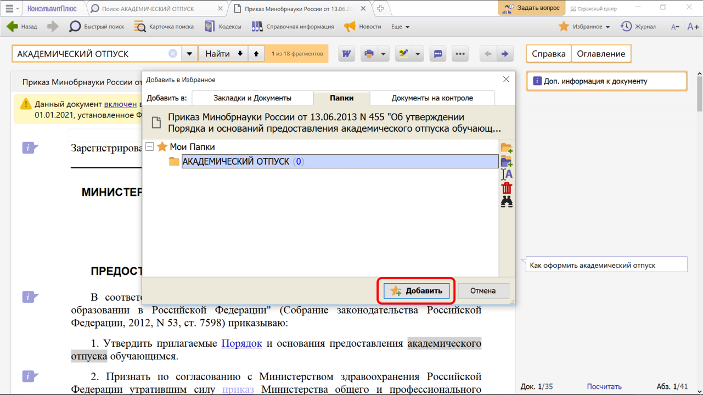
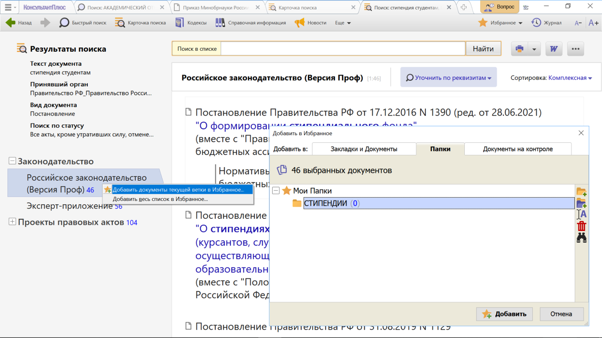

# Практическая работа с КонсультантПлюс №7
  
Сохранение документов в папки в системе КонсультантПлюс позволяет быстро обратиться к документам, с которыми работали раньше, без повторного поиска. Папки являются частью блока «Избранное» системы КонсультантПлюс.

## Примеры работы с системой

### Пример сохранения документа в папку

Найдем документы, в которых говорится про академический отпуск. Из полученного списка сохраним в папку приказ Минобрнауки России «Об утверждении Порядка и оснований предоставления академического отпуска обучающимся».

Решение:

1. В Быстром поиске зададим: АКАДЕМИЧЕСКИЙ ОТПУСК и нажмем кнопку «Найти».
2. В списке выберем приказ Минобрнауки России и откроем его.
3. Нажмем кнопку «Избранное» панели инструментов.
4. Выберем команду «Добавить в Избранное», в появившемся окне выберем вкладку «Папки».
5. Нажмем кнопку «Создать папку» и зададим имя папки «АКАДЕМИЧЕСКИЙ ОТПУСК» (см. рис.).
6. Нажмем кнопку «Добавить».

### Пример сохранения списка документов в папку

Сохраним в папку все действующие постановления Правительства РФ, касающиеся стипендий студентам.

Решение:

1. Заполним Карточку поиска:
    - в поле «Вид документов» зададим: ПОСТАНОВЛЕНИЕ;
    - в поле «Принявший орган» зададим: ПРАВИТЕЛЬСТВО РФ
    - в поле «Текст документа» введем: СТИПЕНДИЯ СТУДЕНТАМ;
    - в поле «Поиск по статусу» выберем: ВСЕ АКТЫ, КРОМЕ УТРАТИВШИХ СИЛУ, ОТМЕНЕННЫХ И НЕ ВСТУПИВШИХ В СИЛУ.
    - Нажмем кнопку «Показать список документов».
2. Установим курсор на названии информационного банка «Российское законодательство (Версия Проф)» в левой части дерева-списка, нажмем правую кнопку мыши и выберем команду «Добавить документы текущей ветки в Избранное».
3. В открывшемся окне выберем вкладку «Папки», нажмем кнопку «Создать папку» и зададим имя папки, например, СТИПЕНДИИ (см. рис.).
4. Нажмем кнопку «Добавить». Все полученные по запросу документы из информационного банка будут занесены в созданную папку.
5. Чтобы в дальнейшем извлечь документы из папки и продолжить с ними работу, надо перейти в окно «Избранное», выбрать вкладку «Папки» и открыть нужную папку.

### Пример операции с папками

Сформируем подборки документов, изданных после 1 января 2023 г., в которых речь идет об уставном капитале акционерных обществ (АО) и обществ с ограниченной ответственностью (ООО). Выясним, есть ли одинаковые документы в подборках.

Решение:

1. Заполним Карточку поиска (область поиска «Законодательство»):
    - в поле «Текст документа» введем: УСТАВНЫЙ КАПИТАЛ АО;
    - в поле «Дата» укажем «Позже чем»: 01.01.2023. 
    - Нажмем кнопку «Показать список документов».
2. Занесем полученные документы информационного банка «Российское законодательство (Версия Проф)» в папку:

    - щелкнем правой клавишей мыши по названию данного информационного банка и выберем команду «Добавить документы текущей ветки в Избранное»;
    - в окне «Добавить в Избранное» нажмем кнопку «Создать папку» и зададим имя папки, например, АО;
    - нажмем кнопку «Добавить».
3. Вернемся в Карточку поиска и заполним ее следующим образом:
    - в поле «Текст документа» введем: УСТАВНЫЙ КАПИТАЛ ООО;
    - в поле «Дата» укажем «Позже чем»: 01.01.2023.
    - Нажмем кнопку «Показать список документов».
4. Занесем полученные документы информационного банка «Российское законодательство (Версия Проф)» в папку (см. п. 2) и зададим имя папки, например, ООО;
5. Чтобы выяснить, есть ли одинаковые документы в полученных папках:
    - перейдем в окно «Избранное» и выберем вкладку «Папки»;
    - отметим папки «АО» и «ООО» левой кнопкой мыши, удерживая одновременно клавишу Ctrl (или с помощью клавиши «Insert»);
    - затем нажмем правую кнопку мыши и в пункте «Операции с папками» выберем команду «Пересечь...» (см. рис.).
6. В результате этой операции появится дерево-список тех документов, которые входят одновременно в обе папки. Если одинаковых документов в выбранных папках нет, то система выдаст сообщение «Список пуст».

## Задания

### Задание №1

Сохраните в папку подборку документов о выпускной квалификационной (дипломной) работе. Укажите количество документов в папке.

### Задание №2

Создайте папку «Акты Минздрава» и поместите в нее все приказы и
методические рекомендации Минздрава России, изданные с начала
2021 г., в тексте которых упоминается коронавирусная инфекция.
Сохраните папку в файл с таким же названием.

### Задание №3

Найдите и сохраните в одну папку все статьи, изданные в первом
полугодии 2022 г., в тексте которых содержится словосочетание
«административная ответственность», а в другую папку – статьи, в
тексте которых содержится словосочетание «уголовная
ответственность». Укажите количество документов, полученных при
объединении указанных папок.

### Задание №4

Сохраните в одну папку все документы, изданные в четвертом
квартале 2022 г., в названии которых есть слова «трудовой договор», а в другую папку – документы, в названии которых есть слова «гражданско-правовой договор». Укажите количество документов, полученных при пересечении указанных папок.
