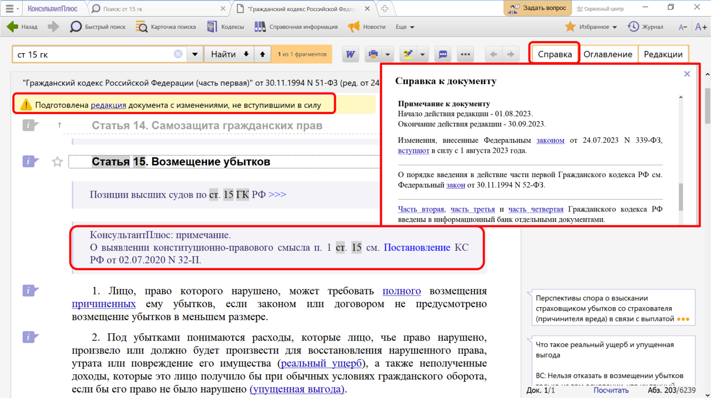
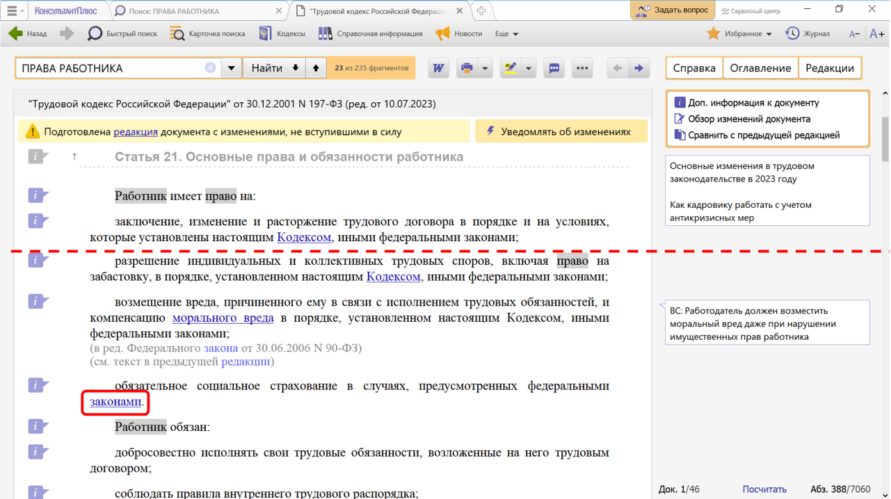

# Практическая работа с КонсультантПлюс №8
  
Информационная строка в верхней части окна с текстом документа и Справка к документу содержат важную информацию об особенностях применения документа. А примечания в тексте и ссылки в документе позволяют выяснить особенности применения отдельных его частей.

## Примеры работы с системой

### Пример анализа найденного документа

Найдем ст. 15 Гражданского кодекса РФ (часть первая). Рассмотрим, как она представлена в системе КонсультантПлюс.

Решение:

1. В Быстром поиске зададим: СТ 15 ГК.
2. Откроем документ (см. рис.).
3. Обратим внимание на информационную строку над текстом документа. Она содержит важную информацию об особенностях применения документа: указано, что есть новая редакция с изменениями, не вступившими в силу. Можно по ссылке перейти в эту редакцию (см. рис.).

4. Нажмем кнопку «Справка» и перейдем в Справку к документу. В поле «Примечание к документу» содержатся подробные сведения об особенностях его применения. Мы не только убедимся в актуальности данной редакции, но и узнаем, до какого момента она будет действовать.
5. Вернемся в текст документа. В тексте статьи размещено специальное примечание об особенностях ее применения (см. рис.).

### Пример использования умной ссылки

Изучим основные права работников. Выясним, в каких случаях работник имеет право на обязательное социальное страхование.

Решение:

1. Зададим в Быстром поиске: ПРАВА РАБОТНИКА.
2. Перейдем в ст. 21 Трудового кодекса РФ. В статье перечислены права работников, среди которых — право на «обязательное социальное страхование в случаях, предусмотренных федеральными законами». В тексте слово «законами» выделено как гиперссылка (см. рис.). Это и есть умная ссылка в системе КонсультантПлюс.

3. Перейдя по этой ссылке, получим список документов, которые регламентируют случаи, когда работник имеет право на обязательное социальное страхование. При переходе в любой из документов списка сразу открывается нужный фрагмент.

## Задания

### Задание №1

Откройте текст Гражданского кодекса РФ (часть вторая). Используя
справку к документу, выясните, с какой даты началось действие данной редакции документа.

### Задание №2

Найдите Трудовой кодекс РФ и определите дату начала действия
актуальной редакции документа. Выясните, каким документом были
внесены последние изменения в текст Трудового кодекса, и когда эти изменения вступили в силу.

### Задание №3

Найдите закон об обществах с ограниченной ответственностью.
Укажите реквизиты документов, которые упоминаются в примечании к
п. 3 ст. 21 данного закона.

### Задание №4

Найдите учебник по исполнительному производству, выпущенный в
2020 г. Укажите, каким издательством он выпущен.

### Задание №5

Вы приобрели в подарок книгу иностранного автора. На следующий
день, выяснив, что именинник хотел эту книгу в другом переводе и
оформлении, вы решили обратиться в магазин с просьбой обменять ее на аналогичную, но в другом издании. Однако в магазине обменять книгу отказались. Выясните, можете ли вы в данном случае обменять качественный товар на аналогичный.

### Задание №6

Гражданин В. решил перенести вход на кухню из коридора в
смежную с кухней комнату, разобрав часть стены. Будет ли это
считаться перепланировкой в соответствии со ст. 25 Жилищного
кодекса РФ?
