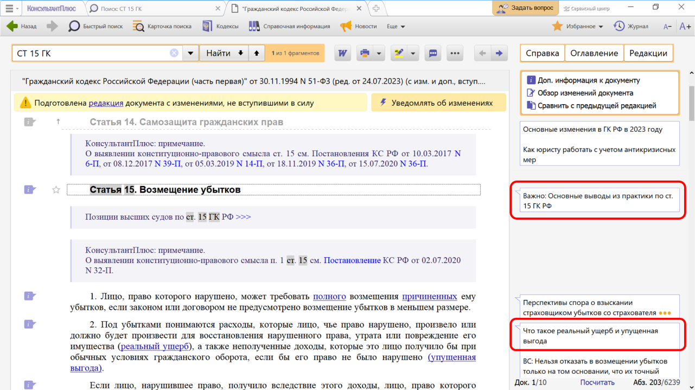
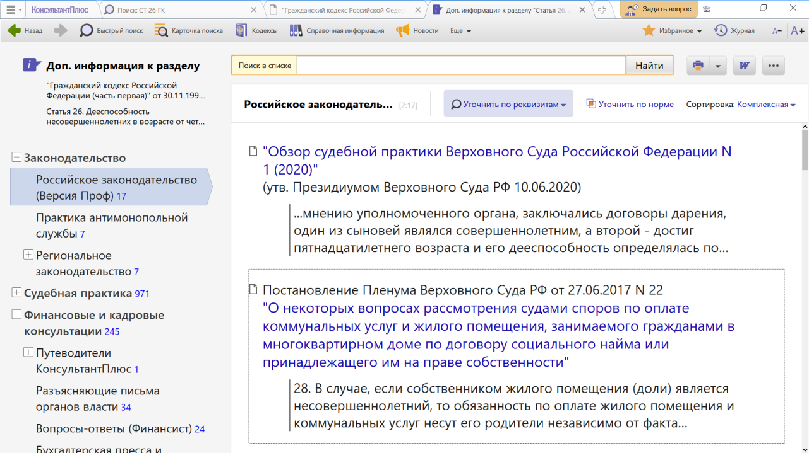

# Практическая работа с КонсультантПлюс №9
  
Часто правовой акт не содержит прямого ответа на наш вопрос. В таких случаях требуется найти и изучить другие документы, содержащие разъяснение норм, комментарии к ним, а также практику применения этих норм.

Для поиска такой информации рекомендуем воспользоваться Примечаниями на правой панели, а также использовать значок «i» на полях документа.

## Примеры работы с системой

### Пример примечания на правой панели

Рассмотрим примечания на правой панели к ст. 15 Гражданского кодекса РФ (часть первая).

Решение:

1. Зададим в Быстром поиска: СТ 15 ГК и нажмем кнопку «Найти».
2. Перейдем в ст. 15 ГК РФ и изучим ее.
3. На правой панели возле заголовка статьи есть ссылка на основные выводы из практики (см. рис.). Перейдем по ссылке. В обзоре даны разъяснения высших судов по применению ст. 15 ГК РФ, проанализированы судебные споры за последние три года, в том числе с неоднозначной судебной практикой, что позволит оценить риски в подобных ситуациях.
4. С помощью кнопки «Назад» вернемся в ст. 15 ГК РФ. Примечания размещены точечно  там, где важно обратить внимание на акценты.
5. Возле нормы п. 2 ст. 15 на правой панели представлена ссылка на Готовое решение «Что такое реальный ущерб и упущенная выгода» (см. рис.). Уже из названия ссылки понятно, о чем пойдет речь. Перейдем по ссылке в готовое решение, где подробно разъяснено, что понимается под убытками и какие их виды существуют.

### Пример поиска дополнительной информации

Несовершеннолетний Н., 17-ти лет, получил в собственность квартиру. Выясним, обязан ли он оплачивать коммунальные услуги, в соответствии со ст. 26 ГК РФ.

Решение:

1. Зададим в Быстром поиска: СТ 26 ГК и нажмем кнопку «Найти».
2. Перейдем в ст. 26 ГК РФ и изучим ее. Видим, что прямого ответа на поставленный вопрос статья не содержит.
3. Воспользуемся значком «i» к ст. 26 ГК РФ. Получим список документов с дополнительной информацией именно к этой статье (см. рис.). Среди документов полученного дерева-списка – правовые акты, судебная практика, консультации, статьи из периодических изданий, комментарии.
4. Откроем Постановление Пленума Верховного Суда РФ от 27.06.2017 № 22 «О некоторых вопросах рассмотрения судами споров по оплате коммунальных услуг и жилого помещения, занимаемого гражданами в многоквартирном доме по договору социального найма или принадлежащего им на праве собственности». Попадем в п. 28 Постановления, где отмечено, что «В случае, если собственником жилого помещения (доли) является несовершеннолетний, то обязанность по оплате жилого помещения и коммунальных услуг несут его родители независимо от факта совместного с ним проживания. Вместе с тем несовершеннолетние в возрасте от 14 до 18 лет вправе самостоятельно вносить плату за жилое помещение и коммунальные услуги. При недостаточности у несовершеннолетнего средств, обязанность по оплате жилого помещения и коммунальных услуг субсидиарно возлагается на его родителей (статья 26 ГК РФ)».

## Задания

### Задание №1

Выясните, обязан ли истец, обратившийся в суд с иском о защите чести и достоинства (в соответствии со ст. 152 ГК РФ), доказывать, что распространенные о нем сведения имеют порочащий характер?

### Задание №2

Статья 59 Семейного кодекса допускает изменение имени и фамилии ребенка. Уточните порядок смены фамилии ребенка до 14 лет.

### Задание №3

Найдите ст. 54 Гражданского кодекса РФ. Укажите виды материалов, размещенных в примечаниях на правой панели к данной статье.

### Задание №4

Выясните, можно ли на основании ст. 32 закона «О защите прав потребителей» вернуть деньги за туристическую путевку, если пришлось отказаться от тура из-за болезни. Узнайте, в каком случае следует платить госпошлину, если потребовалось обратиться в суд с иском по данному вопросу.
