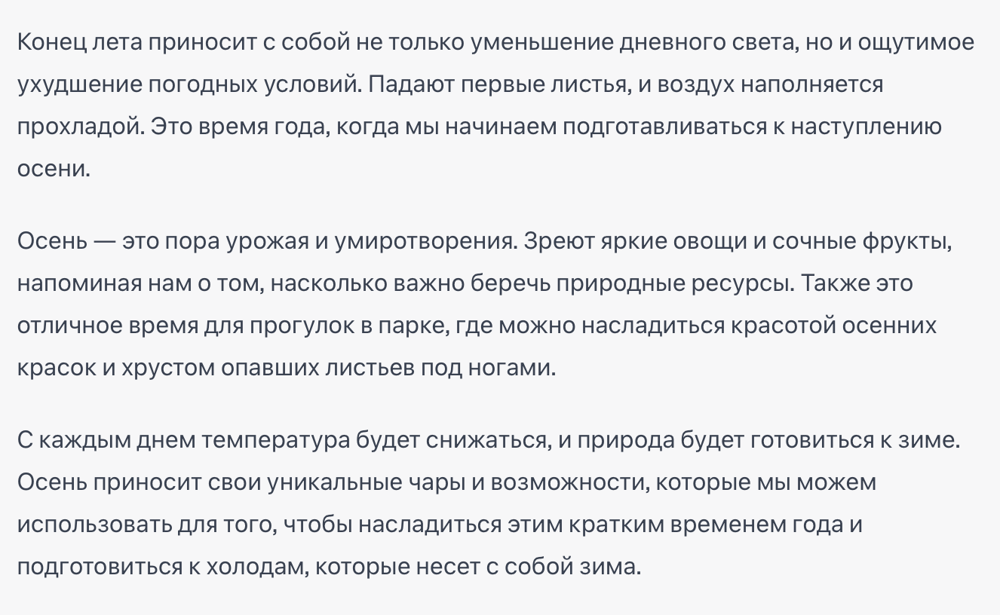

# Лабораторная работа №1

## Задание №1 - Работа с архивами

### Подготовка данных

1. Создать на рабочем столе папку с любым названием
2. Внутри папки создать текстовый файл по аналогии с созданием папки
3. В созданном текстовой файле ввести следующий текст, после чего не забыть сохранить файл:

4. Поместить в эту папку созданный текстовый файл и несколько картинок (скачать из Интернета)
5. Оценить вес и тип (расширение) каждого файла в папке (Клик правой кнопкой мыши по файлу -> свойства) и зафиксировать эту информацию у себя
6. Архивировать созданную папку (клик правой кнопкой мыши по папке -> 7-Zip -> Добавить к архиву...Формат архива выбираем "zip" и нажимаем ок)
7. Оценить вес архива и сравнить его с изначальным весом папки. Изменился ли занимаемый объем?
8. Посчитать на сколько процентов уменьшился вес исходной папки по отношению к архиву
9. Найти партнера по работе и обменятся созданными архивами
10. Распаковать чужой архив на своем компьютере
11. Оценить весь и тип (расширение) каждого файла, полученных из чужого архива и зафиксировать их у себя

## Задание №2 - Сжатие картинок

1. Найти и скачать картинку в Интернете в высоком качестве (пример запроса: скачать картинки в 4k png)
2. Оценить вес скаченной картинки и зафиксировать эту информацию у себя
3. Найти в интернете любой сервис по сжатию картинок (пример запроса: сжать картинку)
4. Загрузить на найденный сервис скаченную картинку
5. Скачать с сервиса сжатую картинку
6. Оценить вес сжатой картинки и зафиксировать эту информацию у себя

## Задание №3 - Системы счисления (по вариантам)

| **Номер варианта** | **Задание 1**                                                              | **Задание 2**                                                              | **Задание 3**                                                               |
| ------------------ | -------------------------------------------------------------------------- | -------------------------------------------------------------------------- | --------------------------------------------------------------------------- |
| Вариант 1          | Переведите число 1101 из двоичной системы счисления в десятичную.          | Как выглядит число 42 в восьмеричной системе счисления?                    | Переведите число 37 из десятичной системы счисления в двоичную.             |
| Вариант 2          | Переведите число 53 из восьмеричной системы счисления в десятичную.        | Переведите число A3 из шестнадцатеричной системы счисления в десятичную.   | Переведите число 123 из десятичной системы счисления в восьмеричную.        |
| Вариант 3          | Как записать число двадцать в римской системе счисления?                   | Переведите число 57 из десятичной системы счисления в шестнадцатеричную.   | Как записать число девяносто в римской системе счисления?                   |
| Вариант 4          | Переведите число C7 из шестнадцатеричной системы счисления в десятичную.   | Переведите число 10111 из двоичной системы счисления в восьмеричную.       | Как выглядит число сорок два в восьмеричной системе счисления?              |
| Вариант 5          | Переведите число 1110010 из двоичной системы счисления в десятичную.       | Как записать число сто в римской системе счисления?                        | Переведите число 246 из восьмеричной системы счисления в двоичную.          |
| Вариант 6          | Переведите число B4 из шестнадцатеричной системы счисления в десятичную.   | Переведите число 1110 из двоичной системы счисления в восьмеричную.        | Как записать число пятьдесят в римской системе счисления?                   |
| Вариант 7          | Переведите число 1001001 из двоичной системы счисления в десятичную.       | Переведите число 71 из восьмеричной системы счисления в шестнадцатеричную. | Переведите число 128 из десятичной системы счисления в двоичную.            |
| Вариант 8          | Как выглядит число 90 в шестнадцатеричной системе счисления?               | Как записать число двенадцать в римской системе счисления?                 | Переведите число 64 из восьмеричной системы счисления в двоичную.           |
| Вариант 9          | Переведите число 1010101 из двоичной системы счисления в десятичную.       | Переведите число 55 из восьмеричной системы счисления в шестнадцатеричную. | Переведите число 1A из шестнадцатеричной системы счисления в восьмеричную.  |
| Вариант 10         | Переведите число FF из шестнадцатеричной системы счисления в десятичную.   | Как записать число сорок в римской системе счисления?                      | Переведите число 1101100 из двоичной системы счисления в восьмеричную.      |
| Вариант 11         | Переведите число 10101010 из двоичной системы счисления в десятичную.      | Переведите число 36 из восьмеричной системы счисления в двоичную.          | Переведите число FF из шестнадцатеричной системы счисления в восьмеричную.  |
| Вариант 12         | Как записать число пятьдесят в римской системе счисления?                  | Переведите число 124 из десятичной системы счисления в восьмеричную.       | Как выглядит число 50 в шестнадцатеричной системе счисления?                |
| Вариант 13         | Переведите число 1101101 из двоичной системы счисления в восьмеричную.     | Как записать число 75 в восьмеричной системе счисления?                    | Переведите число C1 из шестнадцатеричной системы счисления в двоичную.      |
| Вариант 14         | Переведите число 101001 из двоичной системы счисления в десятичную.        | Переведите число 62 из восьмеричной системы счисления в шестнадцатеричную. | Как выглядит число 19 в восьмеричной системе счисления?                     |
| Вариант 15         | Переведите число 22 из восьмеричной системы счисления в десятичную.        | Как записать число сто двадцать в римской системе счисления?               | Переведите число 1D1 из шестнадцатеричной системы счисления в восьмеричную. |
| Вариант 16         | Как выглядит число 80 в шестнадцатеричной системе счисления?               | Переведите число 1111 из двоичной системы счисления в шестнадцатеричную.   | Переведите число 35 из десятичной системы счисления в двоичную.             |
| Вариант 17         | Переведите число 1001010 из двоичной системы счисления в десятичную.       | Переведите число 177 из восьмеричной системы счисления в десятичную.       | Переведите число 17 из восьмеричной системы счисления в шестнадцатеричную.  |
| Вариант 18         | Как записать число тридцать в римской системе счисления?                   | Переведите число 1AB из шестнадцатеричной системы счисления в десятичную.  | Переведите число 110101 из двоичной системы счисления в восьмеричную.      |
| Вариант 19         | Переведите число 100011 из двоичной системы счисления в восьмеричную.      | Как выглядит число 12B в шестнадцатеричной системе счисления?              | Переведите число 62 из восьмеричной системы счисления в десятичную.         |
| Вариант 20         | Переведите число 101100 из двоичной системы счисления в шестнадцатеричную. | Переведите число 54 из восьмеричной системы счисления в двоичную.          | Как записать число 101 в римской системе счисления?                         |
