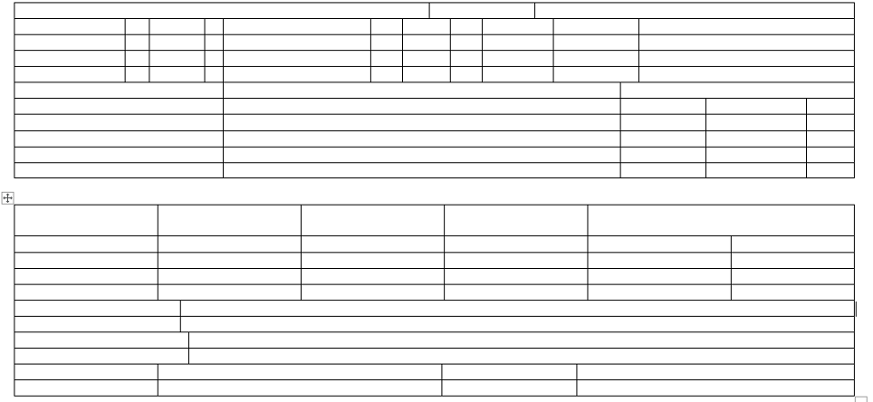
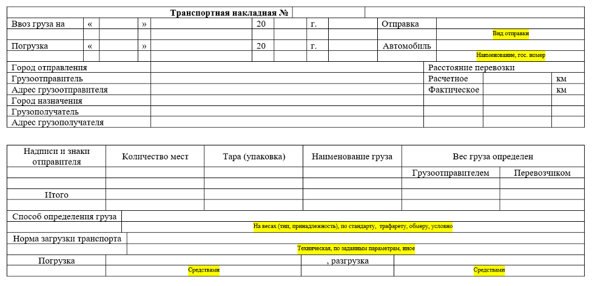
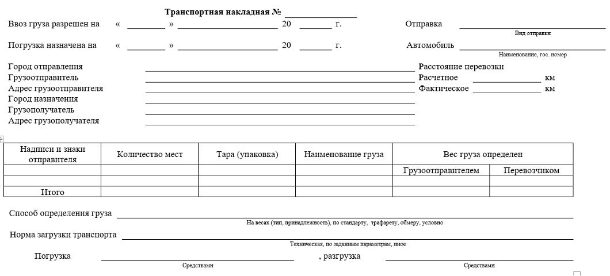
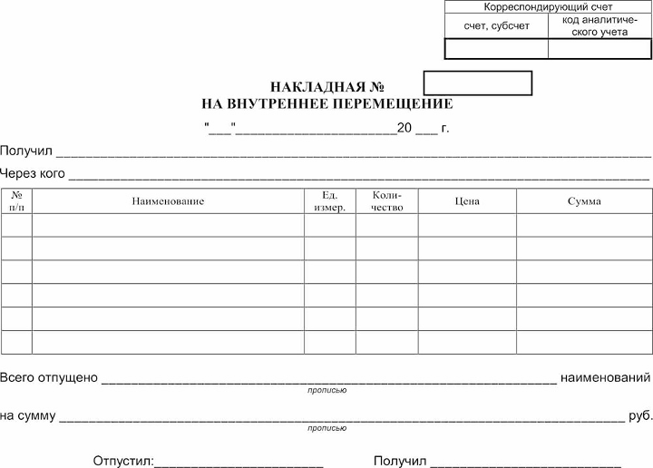

# Лабораторная работа №4

Создание документа на основе таблиц.

## Задание №1

1. Открыть MS Word. Расположить рабочий лист горизонтально: `Вкладка "Макет" -> Ориентация -> Альбомная`
2. Создать таблицы-подложки согласно шаблону:

Для создание таблицы зайдите: Вкладка «Вставка» -> Таблицы и задайте таблицу со следующими параметрами: 11 столбцов, 11 строки.

Настройте ширину столбцов и их объединение согласно рисунку выше. Для этого, установите курсор на таблице, выберите Вкладку «Макет» -> Объединить.

Для настройки ширины столбцов, выделите две (или более) смежные ячейки, подведите курсор на границу ячейки и передвиньте нужную границу.

3. Заполните ячейки текстом (12 Times New Roman), указанным на рисунке ниже.  Для выражений, выделенных желтым цветом, необходимо применить «Надстрочный шрифт» (Ищите кнопку с изображением x в квадрате ниже настроек размера шрифта).

4. Настройте видимость границ ячеек в таблице согласно рисунку ниже. Для настройки границ ячеек, необходимо выделить всю таблицу, выбрать Вкладку «Конструктор таблиц» -> Границы –> Нет границ. В соответствии с рисунком 4 необходимо задать Нижнюю границу ячейки.

## Задание №2

Аналогичным способом необходимо создать следующий документ. При создании указанного документа применять шрифт 12 Times New Roman.

