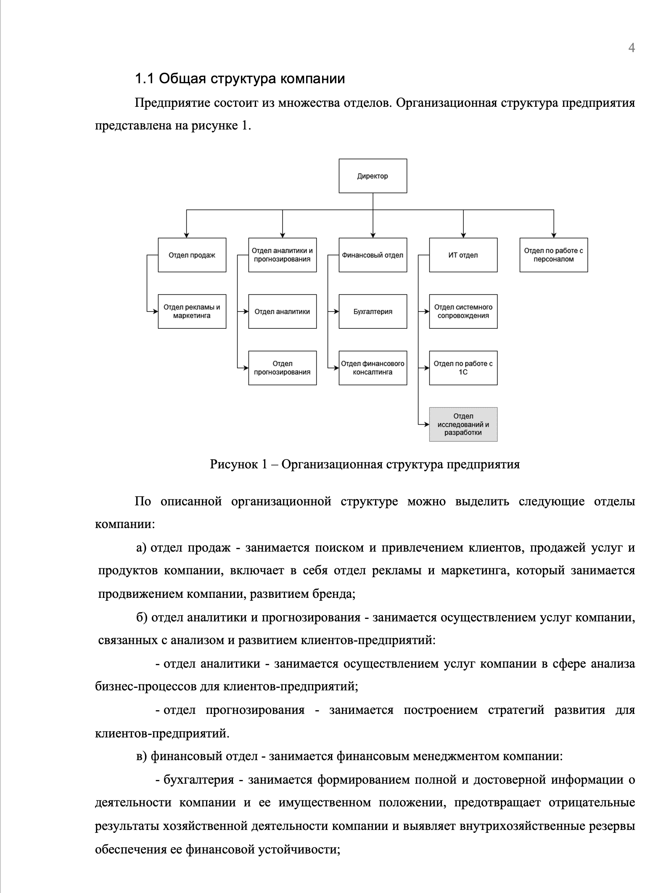
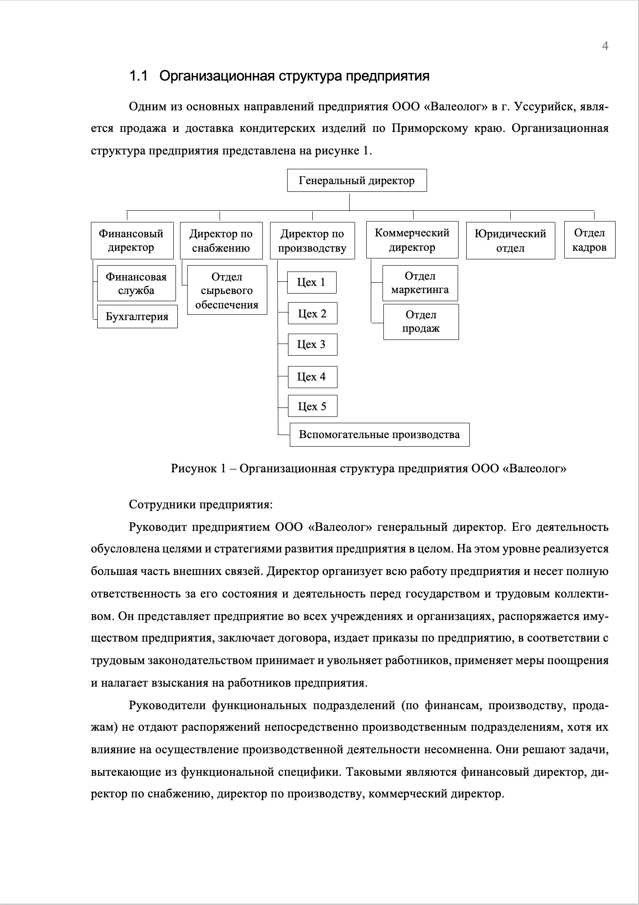

# Лабораторная работа №5

## Построение диаграмм

Цель работы: научиться строить диаграммы и помещать их в документы.

### Задание

1. Открыть сервис для построения диаграмм по ссылке: https://app.diagrams.net
2. `Сохранять диаграммы в...` нажать `Выбрать позже`
3. Сформировать иерархическую структуру компании с помощью сервиса (компанию можно выдумать).
4. Для сохранения своей диаграммы в виде изображения, необходимо нажать на `Файл` в верхней левом углу, далее `Экспортировать как` и выбрать `PNG...`. В появившемся окне нажать кнопку `Экспортировать`, далее ввести имя для изображения, в выпадающем списке выбрать `Загрузить` и затем нажать на кнопку `Сохранить`.
5. Открыть MS Word и создать новый документ.
6. Поместить изображение на лист документа, можно просто перетащить изображения на лист, либо зайти во вкладку `ВСТАВКА`, затем `Рисунки` и выбрать нужное изображение.
7. Ниже написать текст, который описывает диаграмму (см. пример ниже).
8. Для рисунка сделать подпись, выше рисунка сделать заголовок и написать вводный текст перед изображением
9. Оформить получившийся документ согласно стандартам СТО ВГУЭС.

Пример документа, описание отделов продолжается на следующих страницах:

Другой пример:

