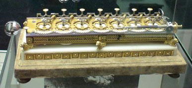
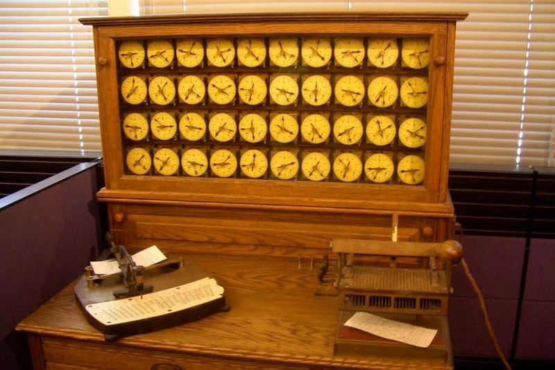
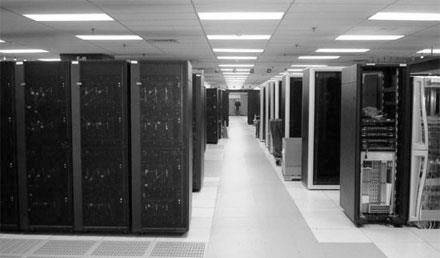
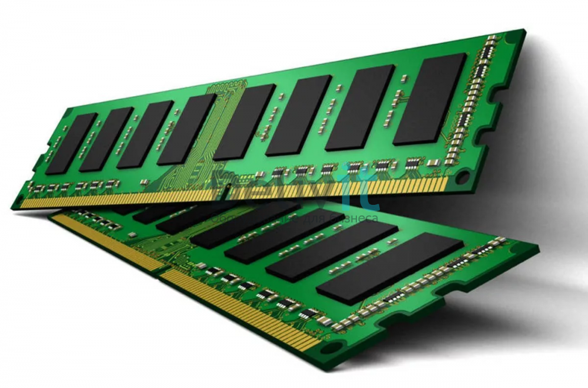
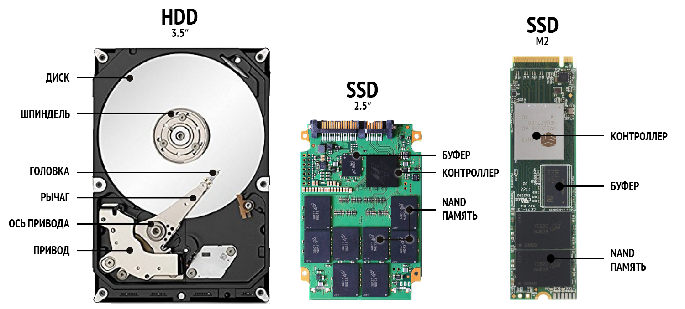
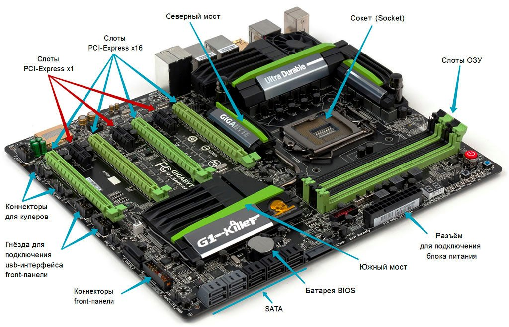
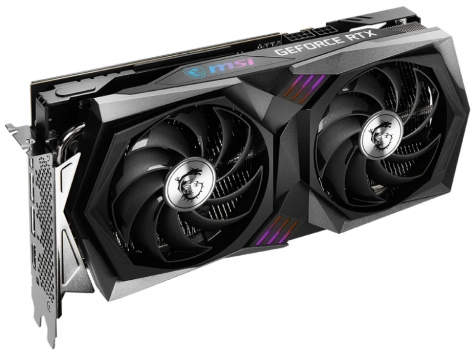
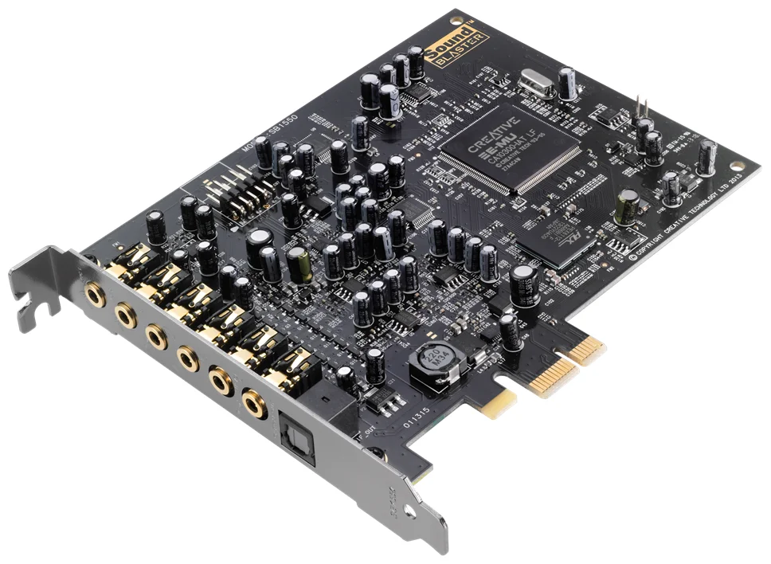
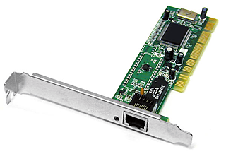
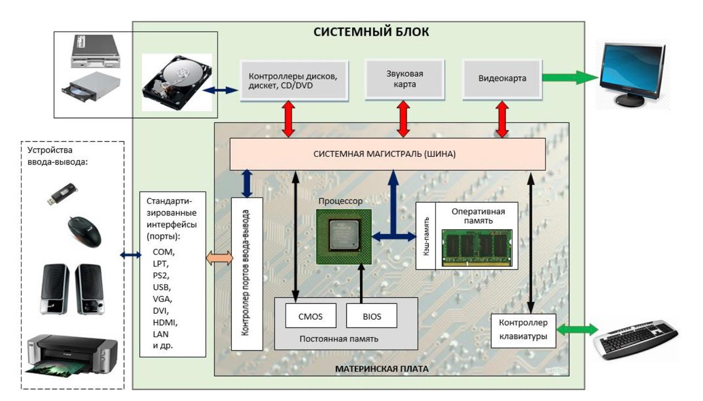

# Вычислительная техника. История. Классификация. Состав вычислительной техники. Аппаратное и программного обеспечение.

## Введение

Совокупность устройств, предназначенных для автоматической или автоматизированной обработки данных, называют вычислительной техникой. Конкретный набор взаимодействующих между собой устройств, предназначенный для обслуживания одного рабочего участка, называют вычислительной системой. Центральным устройством большинства вычислительных систем является компьютер.

```
Компьютер (англ. computer — «вычислитель», от лат. computo - считаю) — устройство или система, способное выполнять заданную чётко определённую изменяемую последовательность операций, называемую программой.
```

```
Электронно-вычислительная машина (ЭВМ) – комплекс технических средств, где основные функциональные элементы (логические, запоминающие, индикационные и др.) выполнены на электронных элементах, который предназначен для автоматической обработки информации в процессе решения вычислительных и информационных задач.
```

Так как современные компьютеры являются электронными устройствами, то термины «ЭВМ» и «компьютер» можно считать синонимами.

## История развития средств вычислительной техники

Современная ЭВМ – это устройство размером со средних размеров книгу, а ее «интеллектуальные» возможности даже трудно представить непрофессионалу. А ведь начиналось все с простого счета «на пальцах» и камушках, затем на бухгалтерских счетах, потом на механических калькуляторах.

### Типы устройств по поколениям

1. Механические устройства. От первых «счетных машин» Паскаля, Лейбница, Чебышё- ва, Однера и Бэббиджа – до коммерческих арифмометров. Устройства этого типа были построены на основе механических элементов – зубчатых колес и валиков – и предназначались для выполнения арифметических операций. Механические «вычислители» окончательно сошли со сцены в 40-х годах XX века (хотя в России они применялись гораздо дольше).



2. Электромеханические устройства. В этих вычислителях главную роль по-прежнему играла механическая начинка, однако ее помощником стал электрический двигатель. По этому принципу был устроен «табулятор» американского инженера Германа Холерита, а также великое множество его преемников. Электромеханические вычислители активно использовались с начала и до середины XX века. Первые «компьютеры» 30- 40-х годов были построены на основе электромеханических реле.



3. Электронные устройства. В середине 40-х годов электромеханические реле были заменены электронными переключателями (лампами) - и с этого момента берет отсчет история нового типа компьютеров, к которому принадлежат и все современные компьютеры.


## Классификация ЭВМ

Кроме классификации ЭВМ по используемой элементной базе (ЭВМ условно делятся на поколения), существует достаточно много других систем классификации компьютеров. Рассмотрим те из них, которые наиболее часто упоминаются в доступной технической литературе и средствах массовой информации.

### Классификация по назначению

По этому принципу различают: большие ЭВМ, мини-ЭВМ, микро-ЭВМ и персональные компьютеры. К 2010 году класс больших ЭВМ представлен в основном суперкомпьютерами, а мини-ЭВМ и микро-ЭВМ включают в себя универсальные серверы различной мощности.

- Большие ЭВМ – это самые мощные компьютеры. Их применяют для обслуживания очень больших организаций и даже целых отраслей народного хозяйства. За рубежем компьютеры этого класса называют мэйнфреймами (mainframe).



- Мини-ЭВМ от больших ЭВМ отличаются уменьшенными размерами, меньшей производительностью и стоимостью. Такие компьютеры используются крупными предприятиями, научными учреждениями и некоторыми высшими учебными заведениями, сочетающими учебную деятельность с научной. Мини-ЭВМ часто применяют для управления производственными процессами. Для организации работы с мини-ЭВМ также требуется специальный вычислительный центр. Наряду с использованием для управления технологическими процессами мини-ЭВМ успешно применяется для вычислений в многопользовательских вычислительных системах, в системах автоматизированного проектирования, в системах моделирования несложных объектов, в системах искусственного интеллекта.

- Микро-ЭВМ. Компьютеры данного класса доступны многим предприятиям. Организации, использующие микро-ЭВМ, обычно не создают вычислительные центры. Для обслуживания такого компьютера им достаточно небольшой вычислительной лаборатории в составе нескольких человек. В число сотрудников вычислительной лаборатории обязательно входят программисты, хотя напрямую разработкой программ они не занимаются. Необходимые системные программы обычно покупают вместе с микро-ЭВМ, а разработку нужных прикладных программ заказывают более крупным вычислительным центрам или специализированным организациям.

- Персональный компьютер предназначен для обслуживания одного рабочего места. Он вполне способен удовлетворить большинство потребностей малых предприятий и от- дельных лиц.

### Классификация по типу используемого процессора

Процессор – основной компонент любого компьютера. В электронно-вычислительных машинах это специальный блок, а в персональных компьютерах – специальная микросхема, которая выполняет все вычисления в компьютере. Тип используемого процессора характеризует технические свойства компьютера.

### Современная классификация компьютеров

Все существующие современные компьютеры можно разделить на семь категорий, причем каждой из них соответствует специфическая программная инфраструктура:

- Карманные персональные компьютеры (КПК) – портативные вычислительные устройства, которые обладают широкими функциональными возможностями. Они гораздо проще компьютеров других категорий, однако в комплекте с сотовым телефоном и мобильным принтером могут представлять собой полноценный мобильный офис.
- Портативные компьютеры (notebook),
- Настольные компьютеры. Самая большая категория представленных на рынке ПК. Активно применяются как корпоративными пользователями (Office PC), так и в сфере домашнего использования (Home PC).
- Рабочие станции. Это более дорогостоящие, чем перечисленные выше, компьютерные системы, которые предназначены для использования в специальных областях, например, там, где нужно работать со сложной графикой (трехмерная графика или издательские системы).
- Серверы – это специализированные высокопроизводительные компьютеры, способные обслуживать несколько одновременно подключающихся к ним компьютеров для выполнения определенных задач.
- Суперкомпьютеры. Применяются для решения задач, с которыми не справляются персональные компьютеры и высокопроизводительные сервера. К таким задачам относятся – задачи аэродинамики, сейсмологии, атомной и ядерной физики, космических, военных и оборонных исследований, математического моделирования и др. областей.
- Кластерная система (кластер) – группа компьютеров, объединенных высокоскоростными каналами связи, представляющая собой единый ресурс (с точки зрения пользователя). Такие системы обеспечивают высокую степень отказоустойчивости за счет возможности мгновенного автоматического перехода с вышедшего из строя узла на работающий.

## Основные компоненты персонального компьютера

При всем многообразии модификаций и вариантов персональных компьютеров в любой входят одни и те же устройства. Все устройства можно разделить на внутренние (их называют комплектующими) и внешние, или периферийные.

Комплектующие размещаются внутри системного блока. В свою очередь, внешние (периферийные) устройства подключаются к системному блоку через специальные разъемы-порты. К внешним устройствам относятся устройства ввода-вывода, главные из которых: монитор, клавиатура и мышь. Масса дополнительных внешних устройств – принтеров, сканеров, емких внешних дисков и др. – не являются обязательными для компьютера, но предоставляют его пользователям дополнительные возможности.

- Главным вычислительным элементом компьютера является процессор (центральный процессор, ЦП, CPU (Central Processor Unit)). Он управляет работой остальных элементов (устройств) и выполняет все арифметические и логические операции, связанные с обработкой данных, хранящихся в ячейках (регистрах) внутренней памяти.


- Оперативная память (RAM – Random Access Memory) – устройство для хранения программ и данных, которые обрабатываются процессором в текущем сеансе работы. Оперативная память (ОП) является энергозависимой, т.е. при выключении компьютера все данные, находящиеся в ОП, автоматически удаляются.



- Постоянная память – устройство для долговременного хранения программ и данных (постоянное запоминающее устройство, ПЗУ), является энергонезависимой.



- Материнская плата (motherboard), или системная плата – центральная комплексная печатная плата, предоставляющая электронную и логическую связь между всеми устройствами, входящими в состав персонального компьютера.



- Видеокарта (видеоадаптер, видеоконтроллер) – это электронная плата, которая обрабатывает видеоданные (текст и графику) и управляет работой дисплея: посылает в дисплей сигналы управления яркостью лучей и сигналы развертки изображения.



- Звуковая плата (аудиоадаптер, аудиокарта) – это специальная электронная плата, которая позволяет записывать звук, воспроизводить его и создавать программными средствами с помощью микрофона, наушников, динамиков, встроенного синтезатора и другого оборудования.



- Сетевая карта (сетевой адаптер) – это плата расширения, вставляемая в разъем материнской платы компьютера, которая служит для подключения компьютера к сети.



Общее устройства ПК:


