# Лабораторная работа №1

## Задачи

1. Построить чертеж детали `Крышка`.
2. На основе чертежа создать деталь `Крышка`.

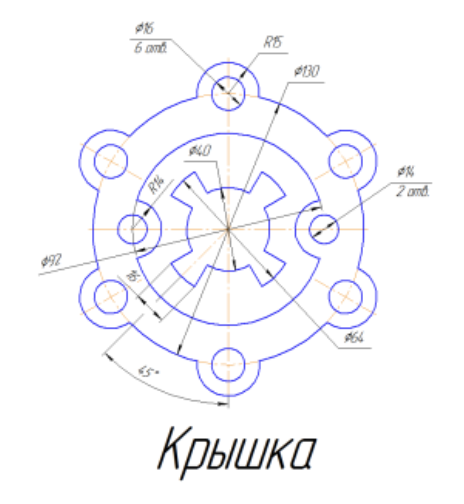

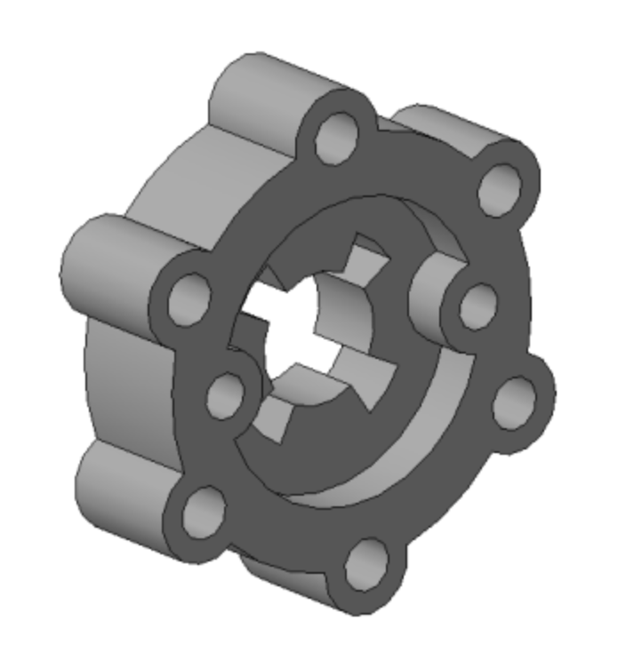

## Ход работы

1. Создайте новый чертеж.
2. Для построения внешнего контура, постройте окружность диаметром `130 мм`. Для чего, вызовите команду либо из списка наборов `Черчение - Геометрия - Окружность`, либо в меню `Черчение - Окружности - Окружность`. Постройте еще две окружности диаметрами `30 мм` и `16 мм`.

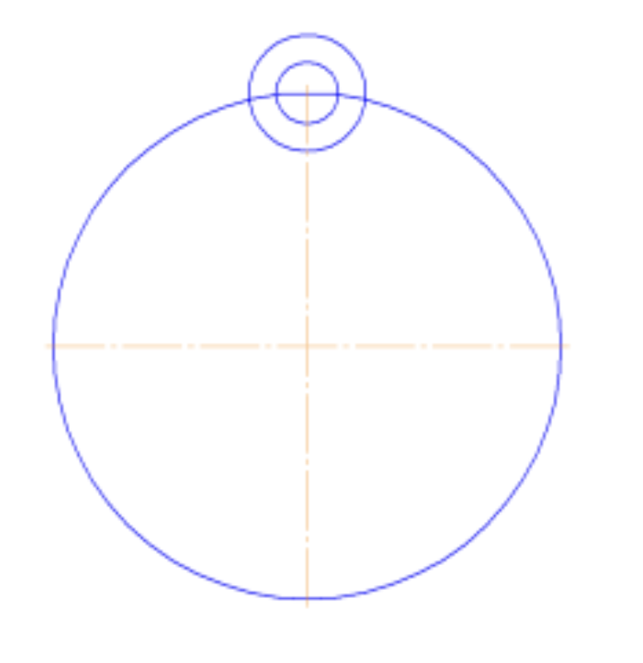

3. Для обрезки лишних линий вызовите команду либо из списка наборов `Черчение - Правка - Усечь кривую`, либо в меню `Черчение - Усечь - Усечь кривую` и укажите обрезаемые части кривых.

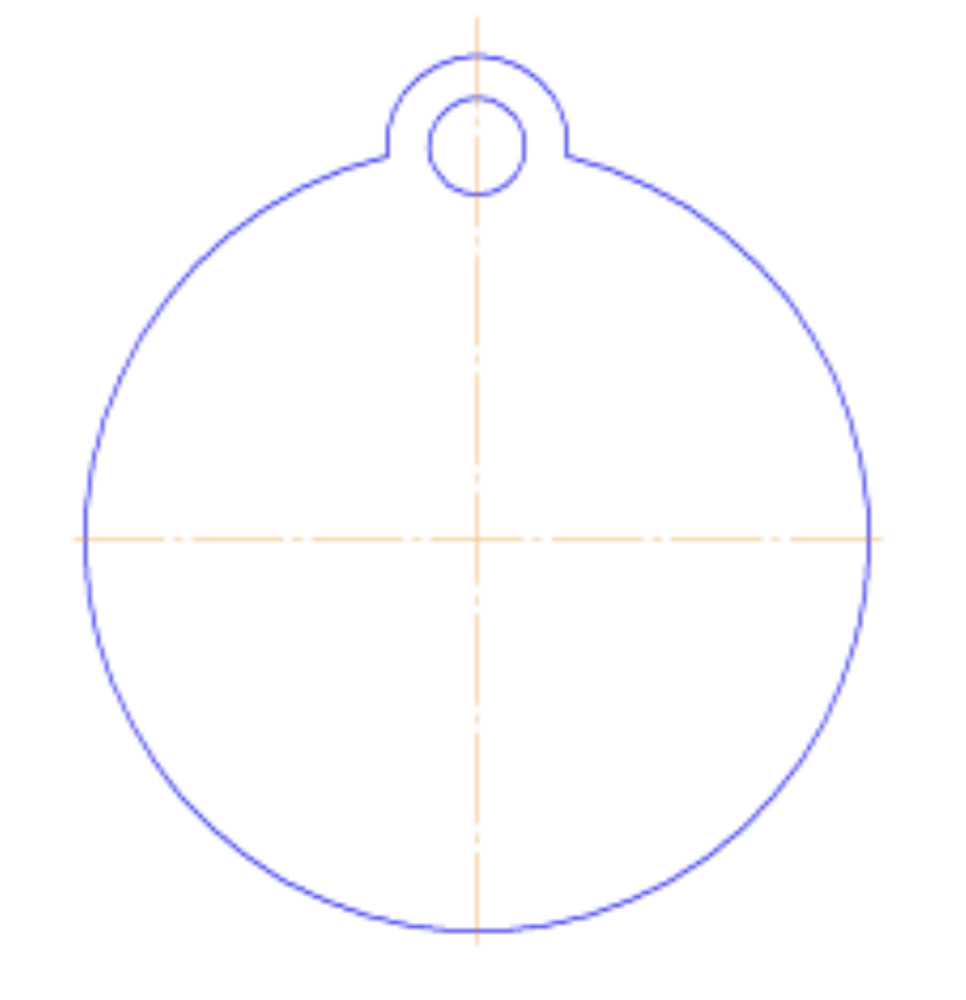

4. Для копирования одинаковых элементов выделите дугу и маленькую окружность, вызовите команду из списка наборов `Черчение - Правка - Копия по окружности`. На `Панели свойств` задайте количество копий – `6`, нажмите кнопку в области `Размещение копий - Вдоль всей окружности` для равномерного распределения элементов массива по окружности, укажите центр массива – центр большой окружности и нажмите кнопку `Создать объект`.
   
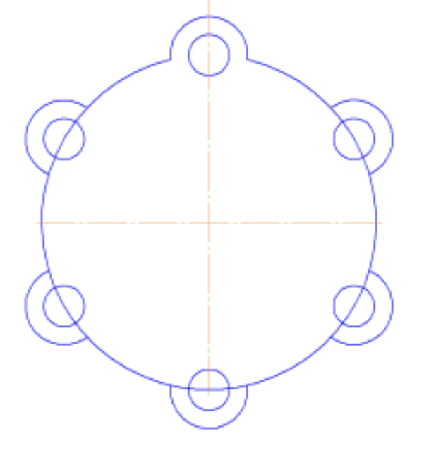

5. Используя команду `Усечь кривую` обрежьте лишние фрагменты кривых.

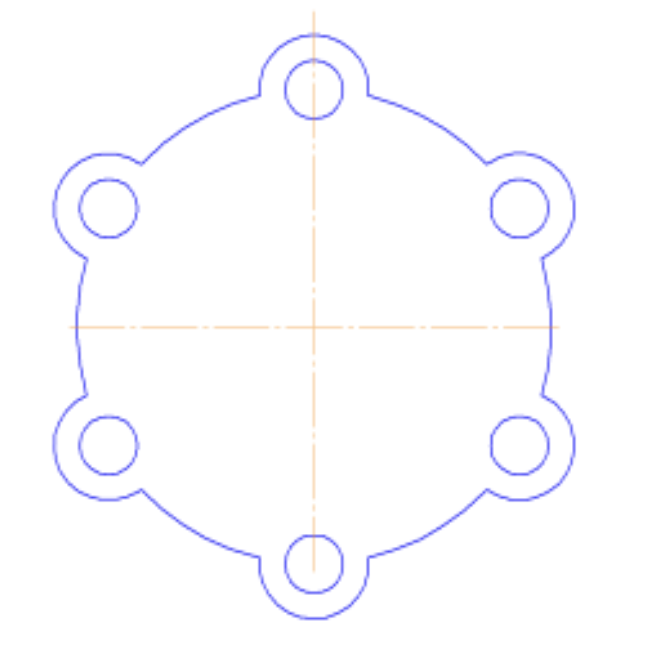

6. Перейдем к построению следующего контура. Создайте окружность диаметром `92 мм` и еще две с диаметрами `14 мм` и `28 мм`.

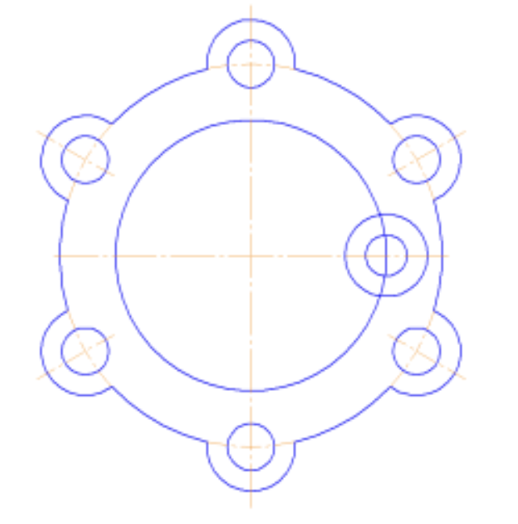

7. Используя команду `Усечь кривую` обрежьте лишние фрагменты кривых.

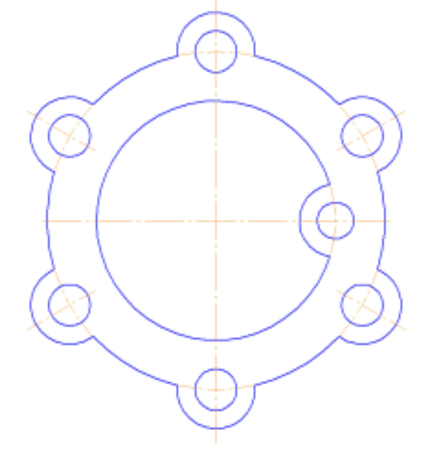

8. Выделите дугу и маленькую окружность. Выберите команду `Правка - Зеркально отразить`. С помощью двух точек, расположенных на вертикальной оси больших окружностей, укажите ось симметрии. Используя команду `Усечь кривую` обрежьте лишние фрагменты кривых.

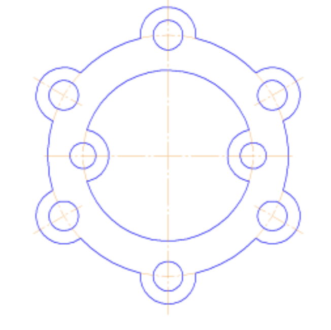

9. Для построения внутреннего контура, постройте две окружности диаметрами `64 мм` и `40 мм`.

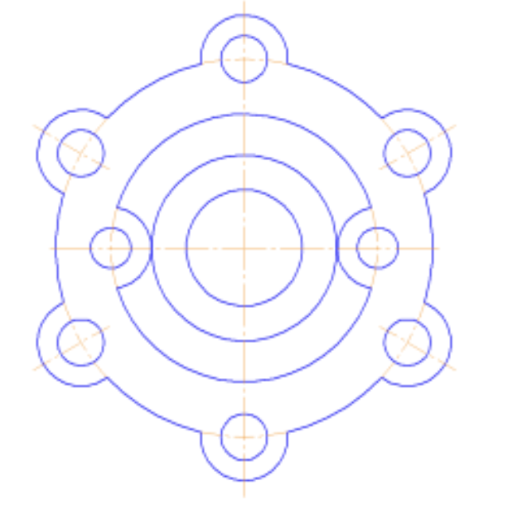

10. Для построения лепестков, постройте три вспомогательные прямые под углом `45°` и на расстоянии от средней линии по `8 мм`, используя команды `Геометрия - Вспомогательная прямая` и `Параллельная прямая`.

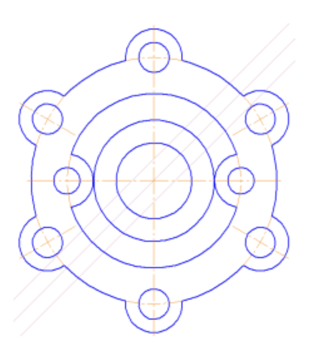

11. Через точки пересечения вспомогательных прямых с окружностью диаметром `64 мм`, постройте два отрезка, пересекающихся в центре больших окружностей, используя команду `Отрезок`.

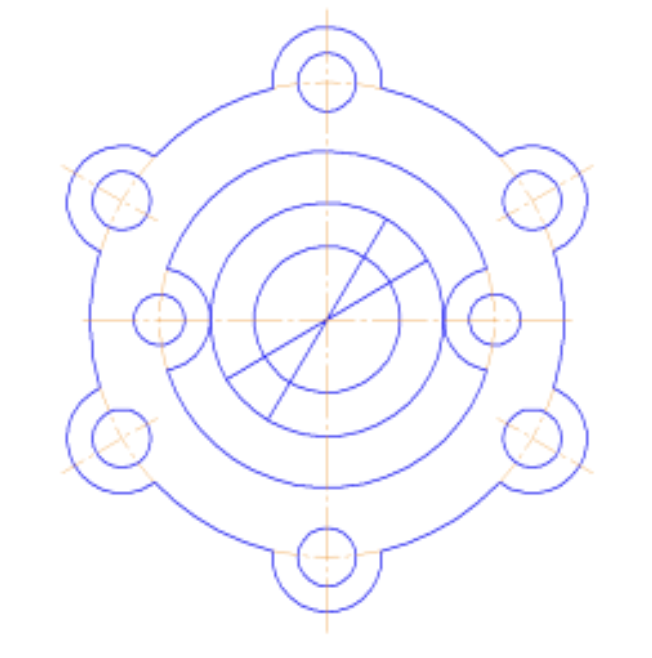

12. Используя команду `Усечь кривую` обрежьте лишние фрагменты кривых.

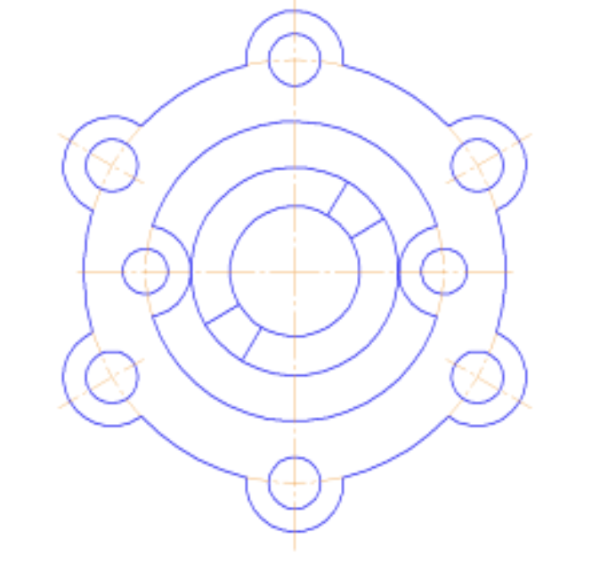

13.  Выделите четыре полученных отрезка. Выберите команду `Правка - Зеркально отразить`. С помощью двух точек, расположенных на вертикальной оси больших окружностей, укажите ось симметрии. Используя команду `Усечь кривую` обрежьте лишние фрагменты окружностей.

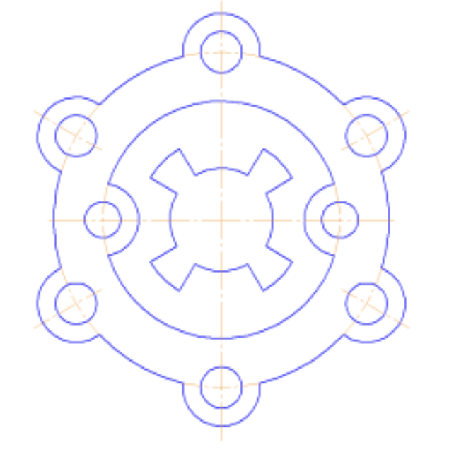

14. Построение чертежа завершено. Можно переходить к созданию детали. Создайте новый файл с деталью.
15. Выберите плоскость `ZY`, войдите в режим эскиза и постройте внешний контур крышки.

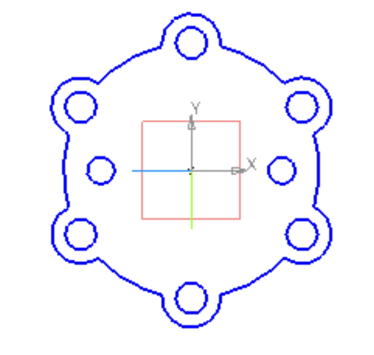

16. Выберите команду из списка наборов `Твердотельное моделирование - Элементы тела - Элемент выдавливания`. Выдавите на расстояние `40 мм` в одном направлении.

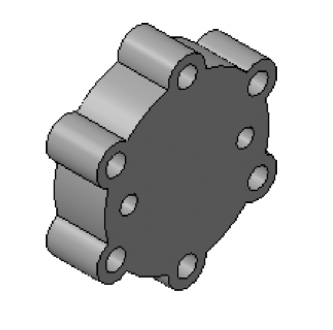

17. Выберите переднюю торцевую плоскость модели, вызовите команду построения эскиза.

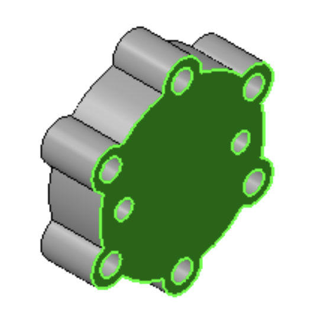

18. Скопируйте из чертежа и вставьте в эскиз второй контур крышки. Выйдите из эскиза.

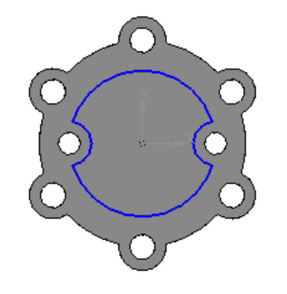

19. Выберите команду из списка наборов `Твердотельное моделирование - Элементы тела - Вырезать выдавливанием`. Вырежьте эскиз в прямом направлении на `15 мм`.

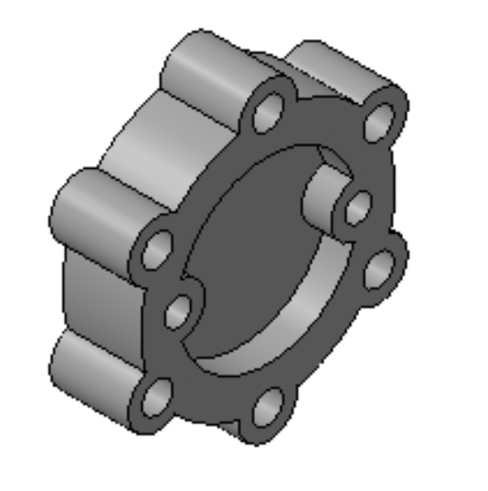

20. Выберите торцевую плоскость построенного углубления, вызовите команду построения эскиза.

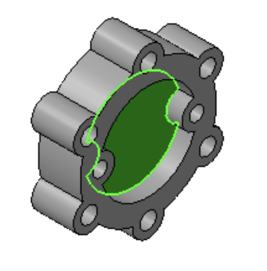

21. Скопируйте из чертежа и вставьте в эскиз третий контур крышки. Выйдите из эскиза.
    
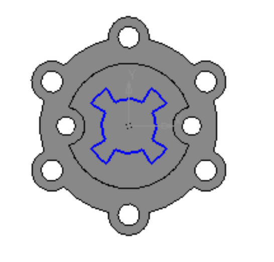

22.  Выберите команду из списка наборов `Твердотельное моделирование - Элементы тела - Вырезать выдавливанием`. Вырежьте эскиз в прямом направлении с опцией `Через все`. В итоге получите модель крышки.